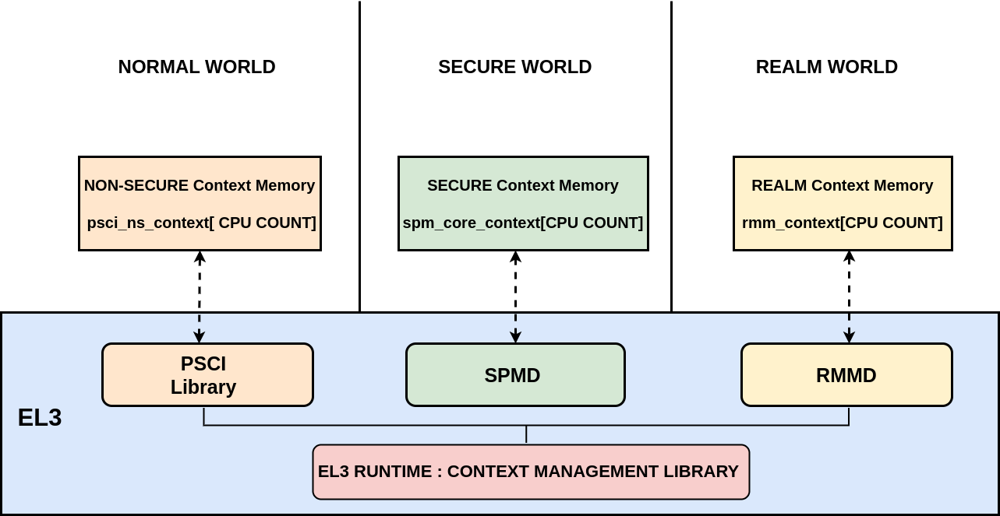
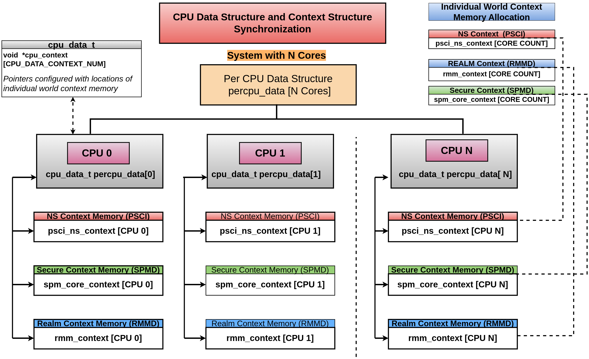
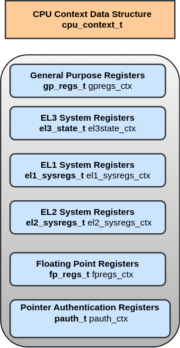
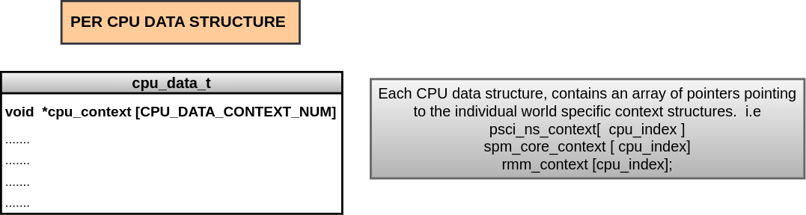

Context Management Library
***************************

This document enumerates and describes the context management library procedures
and their usage.

Overview
========
In a trusted-boot system, there is only one copy of the vector registers,
the general-purpose registers, and most System registers.
When moving between Security states (Secure/Non-Secure/Realm), it is the
responsibility of software, not hardware, to save and restore register values
according to the security states.

The context management library is in charge of initializing/restoring the CPU system
registers during world switch, referred as CPU Context Management.

This library in TF-A provides the basic CPU context initialization and management
routines for use by different components in EL3 firmware.

Originally library was designed for a two world system(Non-Secure and Secure World).
However, library has been refactored to cater for three world and extended to
four world system as well. The four world, system context management is a work in progress,
aiming to be covered by the next release cycle.

Key principles followed in designing the context_management library :

(1) **Decentralized model for context mgmt**

Each world (Non-Secure, Secure, and Realm) should have their separate entity/component
responsible for respective world context management.
Both the Secure and Realm world have associated dispatcher components in EL3
firmware to allow management of the respective worlds.
For the non-secure world, PSCI Library(BL31)/context management library provides
routines to help initialize the Non Secure world context.

(2) **EL3 should only initialize immediate used lower EL**

Context Management library running at EL3 should only initialize and monitor the
immediate used lower EL. This implies that, when S-EL2 is present in the system,
EL-3 should initialise and monitor S-EL2 registers only. S-EL1 registers should
not be the concern of EL3 while S-EL2 is in place. In systems, where S-EL2 is absent,
S-EL1 registers should be initialised from EL3.

(3) **Flexibility for Dispatchers to select desired feature set to save and restore**

Each feature is supported with helper function (is_feature_supported( )), to
decide on its presence at runtime.
This helps dispatchers to select the desired feature set, and thereby
save and restore them.

(4) **Dynamic discovery of Feature enablement by EL3**
TF-A supports three states for feature enablement at EL3, to make them available for
lower exception levels.
FEAT_STATE_DISABLED 0
FEAT_STATE_ENABLED  1
FEAT_STATE_CHECK    2

A pattern is established for feature enablement behavior.
Each feature must support the 3 possible values with rigid semantics
FEAT_STATE_DISABLED - all code relating to this feature is always skipped.
Firmware is unaware of this feature. This is the default for all platforms
(except SVE, TRF, PMUv3 due to legacy).

FEAT_STATE_ALWAYS - all code relating to this feature is always executed.
Firmware expects this feature to be present in hardware.

FEAT_STATE_CHECKED - same as FEAT_STATE_ALWAYS except that the feature's presence
is checked and skipped if not found. Default on dynamic platforms (fvp, qemu, tc).
Moving forwards all features will be set to this value for the fvp.

Bootloader Images utilizing Context Management Library
======================================================

+--------------+--------------------------------------+
| Bootloader   | Context Management Library           |
+--------------+--------------------------------------+
|   BL1        |       Yes                            |
+--------------+--------------------------------------+
|   BL2        |       No                             |
+--------------+--------------------------------------+
|   BL31       |       Yes                            |
+--------------+--------------------------------------+
|   BL32       |       No                             |
+--------------+--------------------------------------+
|   BL33       |       No                             |
+--------------+--------------------------------------+

Context Memory allocation
=========================

|Context memory allocation|

CPUs maintain their context per world. The individual context memory allocation for each core
per world, is allocated by the world specific didpatcher components at compile time.

NS-Context Memory
~~~~~~~~~~~~~~~~~
NS world context memory allocation

``static cpu_context_t psci_ns_context[PLATFORM_CORE_COUNT];``

Secure-Context Memory
~~~~~~~~~~~~~~~~~~~~~
SPM Core context information.

``static spmd_spm_core_context_t spm_core_context[PLATFORM_CORE_COUNT];``

Realm-Context Memory
~~~~~~~~~~~~~~~~~~~~
RMM world context memory allocation

``rmmd_rmm_context_t rmm_context[PLATFORM_CORE_COUNT];``

|CPU Context Memory Configuration|

|CPU Context Structure|

|CPU Data Structure|

Library APIs
------------
The public APIs and types can be found in include/lib/el3_runtime/context_management.h
and this section is intended to provide additional details and clarifications.

Context Initialization for Individual Worlds
~~~~~~~~~~~~~~~~~~~~~~~~~~~~~~~~~~~~~~~~~~~~
The library implements high level APIs for the CPUs in setting up their individual
context for each world (Non-Secure, Secure and Realm).

.. code:: c

	static void setup_context_common(cpu_context_t *ctx, const entry_point_info_t *ep)

This function does the general context initialisation applicable for all the worlds.
It will be invoked first, before calling the individual world specific context
setup APIs.

.. code:: c

	static void setup_ns_context(cpu_context_t *ctx, const struct entry_point_info *ep)
	static void setup_realm_context(cpu_context_t *ctx, const struct entry_point_info *ep)
	static void setup_secure_context(cpu_context_t *ctx, const struct entry_point_info *ep)

Depending on the security state, which the core needs to enter, the respective world
specific context setup handlers listed above will be invoked once per-cpu for
setting up the context for their execution.

.. code:: c

	void cm_manage_extensions_el3(void)

This function initializes all the EL3 registers, whose value does not change for
the lifetime of TF-A. It is invoked from each core via cold boot path ``bl31_main()``
and in WarmBoot entry path ``path void psci_warmboot_entrypoint()``.

Runtime Save and Restore of Registers
~~~~~~~~~~~~~~~~~~~~~~~~~~~~~~~~~~~~~

.. code:: c

	void cm_el1_sysregs_context_save(uint32_t security_state)
	void cm_el1_sysregs_context_restore(uint32_t security_state)

These functions are invoked from the individual world specific dispatcher
components running at EL-3 to save and restore the EL1 system registers during
world switch.

.. code:: c

	void cm_el2_sysregs_context_save(uint32_t security_state)
	void cm_el2_sysregs_context_restore(uint32_t security_state)

These functions are invoked from the individual world specific dispatcher
components running at EL-3 to save and restore the EL2 system registers during
world switch.

Feature Enablement for Individual Worlds
----------------------------------------
#. ``static void manage_extensions_nonsecure(cpu_context_t *ctx);``
#. ``static void manage_extensions_secure(cpu_context_t *ctx);``

*Copyright (c) 2024, Arm Limited and Contributors. All rights reserved.*

