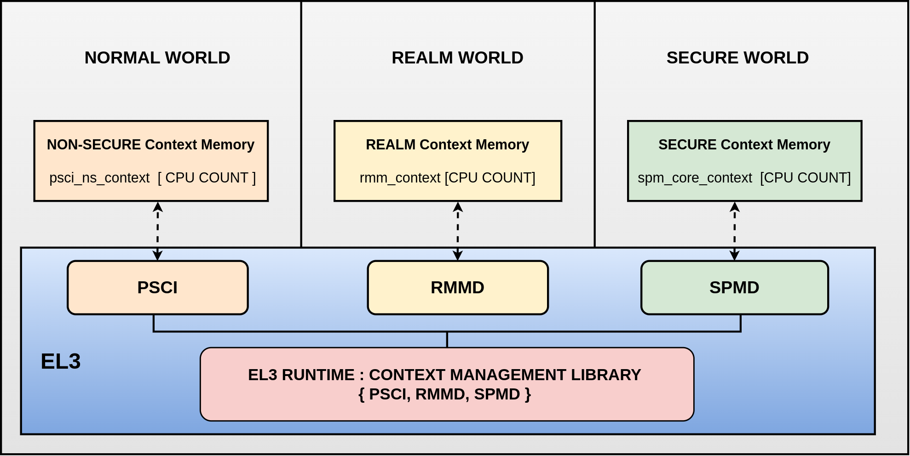
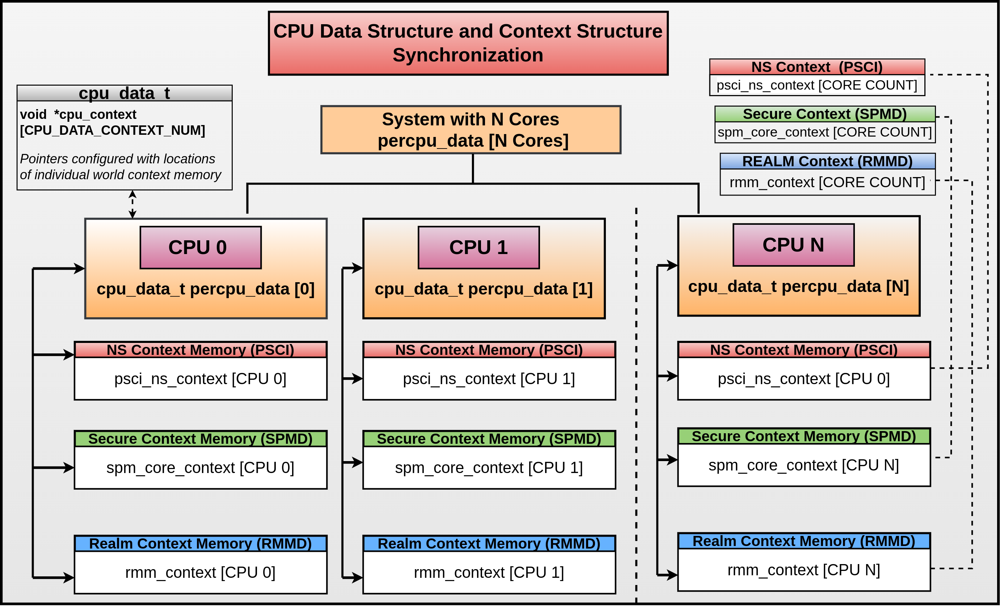
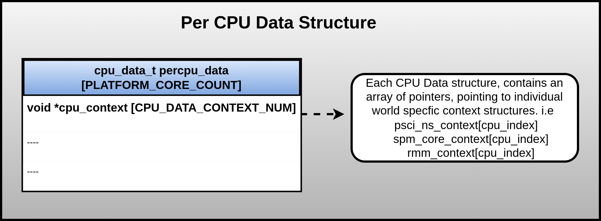
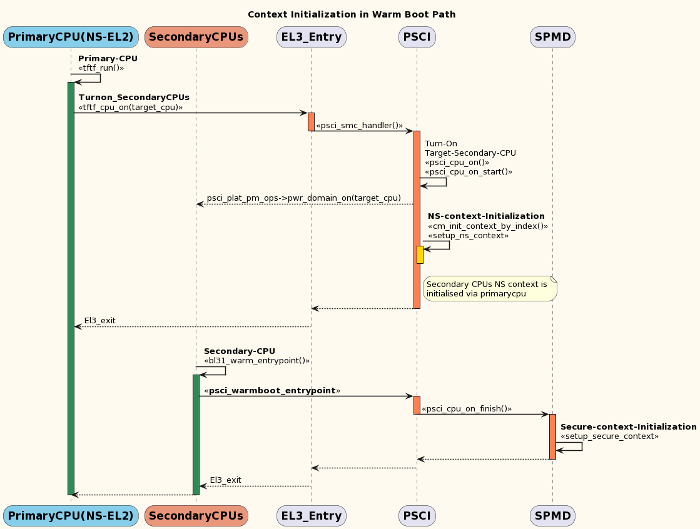

Context Management Library
***************************

This document provides an overview of the Context Management library implementation
in Trusted Firmware-A (TF-A). It enumerates and describes the APIs implemented
and their accessibility from other components at EL3.

Overview
========

In a trusted-boot system (AArch64 mode) general-purpose registers, most of the
system registers and vector registers are not banked.
When moving between the Security states (Secure/Non-Secure/Realm), it is the
responsibility of the software (secure monitor), not the hardware, to save and
restore register state. Refer `Trustzone for AArch64`_ for more details.

EL3 Runtime Firmware(BL31), also termed as secure monitor firmware, is integrated
with a context management library support to handle the context of the CPU
thereby saving and restoring the register state across the world
(Non-Secure/Secure/Realm).

In simple terms, context is a data structure used by the EL3 firmware to preserve
the state of the CPU at the next lower EL in a given security state and save
enough EL3 metadata to be able to return to that Exception level and security state.

In a trusted system at any instance, a given core can be executed in any world
(Normal, Secure, Realm). Each world must have its configuration of system registers
independent of other security states to access and execute any of the
architectural features.

This covers a range of settings beginning with register bits (SCR_EL3.NS and
SCR_EL3.NSE) to configure the security state for the individual world, feature enablement
for each security state, saving and restoring register contents (EL1, EL2, vector)
and other registers which are likely to be overwritten across the worlds and some
errata bits etc.

If the core switches across security states (from non-secure to secure or vice versa),
the register contents, especially the ones that are not banked (EL2/EL1, vector,
general-purpose registers), will be overwritten as the software running in either
state has the privileges to access them. Additionally, some of the architectural
features enabled in one security state will be unconditionally accessible in the
other security state as well. This can be a major concern when dealing with
security-specific bits, as they need to be explicitly enabled or disabled in each
state to prevent data leakage across the worlds. Therefore, the context, inclusive
of all these system registers, needs to be safely guarded and handled to prevent
data leakages across the worlds.

In general, an ideal trusted system should have Secure World-specific configurations
that are not influenced by Normal World operations, and vice versa. Therefore,
for each core, we need to maintain world-specific context to ensure that register
entries from one world do not leak or impact the execution of the CPU in other worlds.
This will help ensure the integrity and security of the system, preventing any
unauthorized access or data leakage between the different security states.

The Context Management library in TF-A is designed to cover all the requirements
for maintaining world-specific context essential for an trusted system.
This includes implementing CPU context initialization and management routines,
as well as other helper APIs that are required by dispatcher components in EL3
firmware, which are collectively referred to as CPU Context Management.
APIs and their usecases are listed in detail under ``Library APIS``
section.

Originally, the Context Management library in TF-A was designed to cater for a
two-world system, comprising of Non-Secure and Secure Worlds. However, the
library has since been refactored to cater to three-world and extended to four-world
systems as well. The four world system context management is a work in progress,
aiming to be covered by the next release cycle.

Key principles followed in designing the context_management library :

(1) **Decentralized model for context mgmt**

Each world (Non-Secure, Secure, and Realm) should have their separate entity/component
responsible for respective world context management.
Both the Secure and Realm world have associated dispatcher components in EL3
firmware to allow management of the respective worlds. For the non-secure world,
PSCI Library(BL31)/context management library provides routines to help initialize
the Non Secure world context.

(2) **EL3 should only initialize immediate used lower EL**

Context Management library running at EL3 should only initialize and monitor the
immediate used lower EL. This implies that, when S-EL2 is present in the system,
EL-3 should initialise and monitor S-EL2 registers only. S-EL1 registers should
not be the concern of EL3 while S-EL2 is in place. In systems, where S-EL2 is absent,
S-EL1 registers should be initialised from EL3.

(3) **Flexibility for Dispatchers to select desired feature set to save and restore**

Each feature is supported with helper function (is_feature_supported( )), to
decide on its presence at runtime. This helps dispatchers to select the desired
feature set, and thereby save and restore them.

(4) **Dynamic discovery of Feature enablement by EL3**
TF-A supports three states for feature enablement at EL3, to make them available
for lower exception levels.

.. code:: c

	#define FEAT_STATE_DISABLED	0
	#define FEAT_STATE_ENABLED	1
	#define FEAT_STATE_CHECK	2

A pattern is established for feature enablement behavior.
Each feature must support the 3 possible values with rigid semantics.

**FEAT_STATE_DISABLED** - all code relating to this feature is always skipped.
Firmware is unaware of this feature. This is the default for all platforms
(except SVE, TRF, PMUv3 due to legacy).

**FEAT_STATE_ALWAYS** - all code relating to this feature is always executed.
Firmware expects this feature to be present in hardware.

**FEAT_STATE_CHECKED** - same as ``FEAT_STATE_ALWAYS`` except that the feature's
presence is checked and skipped if not found. Default on dynamic platforms
(fvp, qemu, tc). Moving forward all features will be set to this value for the fvp.

Code Structure
==============
**lib/el3_runtime/(aarch32/aarch64)** - Context library code directory.

Source Files
~~~~~~~~~~~~

#. ``context_mgmt.c`` : consists of core functions that setup, save and restore
   context for different security states alongside high level feature enablement
   APIs for individual worlds.

#. ``cpu_data_array.c`` : contains per_cpu_data structure instantiation.

#. ``context.S`` : consists of functions that save and restore some of the context
   structure members in assembly code.

#. ``cpu_data.S`` : consists of helper functions to initialise per_cpu_data pointers.

#. ``el3_common_macros.S`` : consists of macros to facilitate actions to be performed
   during cold and warmboot and el3 registers initialisation in assembly code.

Header Files
~~~~~~~~~~~~

#. ``context_mgmt.h`` :  contains the public interface to Context Management Library.

#. ``context.h`` : contains the helper macros and definitions for context entries.

#. ``cpu_data.h`` : contains the public interface to Per CPU data structure.

#. ``context_debug.h`` : contains public interface to report context memory
   utilisation across the security states.

#. ``context_el2.h`` : internal header consisting of helper macros to access EL2
   context entries. Used by ``context.h``.

Apart from these files, we have some context related source files under ``BL1``
and ``BL31`` directory. ``bl1_context_mgmt.c`` ``bl31_context_mgmt.c``

Bootloader Images utilizing Context Management Library
======================================================

+--------------+--------------------------------------+
| Bootloader   | Context Management Library           |
+--------------+--------------------------------------+
|   BL1        |       Yes                            |
+--------------+--------------------------------------+
|   BL2        |       No                             |
+--------------+--------------------------------------+
|   BL31       |       Yes                            |
+--------------+--------------------------------------+
|   BL32       |       No                             |
+--------------+--------------------------------------+
|   BL33       |       No                             |
+--------------+--------------------------------------+

CPU Data Structure
==================
For a given system, depending on the core count, the platform statically
allocates memory for the cpu data structure.

.. code:: c

	#File: cpu_data_array.c
	/* The per_cpu_ptr_cache_t space allocation */
	cpu_data_t percpu_data[PLATFORM_CORE_COUNT];

This CPU data structure has a member element with an array of pointers to hold
the non-secure, realm and secure security state context structures as listed below.

.. code:: c

	#File: cpu_data.h
	typedef struct cpu_data {
	#ifdef __aarch64__
	void *cpu_context[CPU_DATA_CONTEXT_NUM];
	#endif

	....
	....

	}cpu_data_t;

|CPU Data Structure|

At runtime, ``cpu_context[CPU_DATA_CONTEXT_NUM]`` array will be intitialised with
the secure, non-secure and realm context structure addresses to ensure proper
handling of the register state.
See ``LIBRARY APIS`` section for more details.

CPU Context and Memory allocation
=================================

CPU Context
~~~~~~~~~~~
The members of the context structure used by the EL3 firmware, to preserve the
state of CPU across exception levels for a given security state is listed below.

.. code:: c

	#File: context.h

	typedef struct cpu_context {
	gp_regs_t gpregs_ctx;
	el3_state_t el3state_ctx;
	el1_sysregs_t el1_sysregs_ctx;

	#if CTX_INCLUDE_EL2_REGS
	el2_sysregs_t el2_sysregs_ctx;
	#endif

	#if CTX_INCLUDE_FPREGS
	fp_regs_t fpregs_ctx;
	#endif

	cve_2018_3639_t cve_2018_3639_ctx;
	#if CTX_INCLUDE_PAUTH_REGS
	pauth_t pauth_ctx;
	#endif

	#if CTX_INCLUDE_MPAM_REGS
	mpam_t	mpam_ctx;
	#endif

	} cpu_context_t;

Context Memory Allocation
~~~~~~~~~~~~~~~~~~~~~~~~~

CPUs maintain their context per world. The individual context memory allocation
for each core per world is allocated by the world-specific dispatcher components
at compile time as shown below.

|Context memory allocation|

NS-Context Memory
~~~~~~~~~~~~~~~~~
It's important to note that the Normal world doesn't possess the dispatcher
component found in the Secure and Realm worlds. Instead, the PSCI library at EL3
handles memory allocation for Normal world context in the ``Non-Secure`` world
and statically allocates memory for Normal world context for all CPUs.

.. code:: c

	#File: psci_setup.c
	static cpu_context_t psci_ns_context[PLATFORM_CORE_COUNT];

Secure-Context Memory
~~~~~~~~~~~~~~~~~~~~~
Secure World dispatcher (SPMD) at EL3 allocates the memory for ``Secure`` world
context of all CPUs.

.. code:: c

	#File : spmd_main.c
	static spmd_spm_core_context_t spm_core_context[PLATFORM_CORE_COUNT];

Realm-Context Memory
~~~~~~~~~~~~~~~~~~~~
Realm World dispatcher (RMMD) at EL3 allocates the memory for ``Realm`` world
context of all CPUs.

.. code:: c

	#File : rmmd_main.c
	rmmd_rmm_context_t rmm_context[PLATFORM_CORE_COUNT];

To summarize, the world-specific context structures are synchronized with
per-CPU data structures, which means that each CPU will have an array of pointers
to individual worlds. The figure below illustrates the same.

|CPU Context Memory Configuration|

Context Setup/Initialization
============================

Cold Boot
~~~~~~~~~

|Context Init ColdBoot|

WarmBoot
~~~~~~~~

|Context Init WarmBoot|

Library APIs
============

The public APIs and types can be found in ``include/lib/el3_runtime/context_management.h``
and this section is intended to provide additional details and clarifications.

Context Initialization for Individual Worlds
~~~~~~~~~~~~~~~~~~~~~~~~~~~~~~~~~~~~~~~~~~~~
The library implements high level APIs for the CPUs in setting up their individual
context for each world (Non-Secure, Secure and Realm).

.. code:: c

	static void setup_context_common(cpu_context_t *ctx, const entry_point_info_t *ep)

This function is responsible for the general context initialization that applies
to all worlds. It will be invoked first, before calling the individual
world-specific context setup APIs.

.. code:: c

	static void setup_ns_context(cpu_context_t *ctx, const struct entry_point_info *ep)
	static void setup_realm_context(cpu_context_t *ctx, const struct entry_point_info *ep)
	static void setup_secure_context(cpu_context_t *ctx, const struct entry_point_info *ep)

Depending on the security state that the core needs to enter, the respective
world-specific context setup handlers listed above will be invoked once per-CPU
to set up the context for their execution.

.. code:: c

	void cm_manage_extensions_el3(void)

This function initializes all EL3 registers whose values do not change during the
lifetime of TF-A. It is invoked from each core via the cold boot path ``bl31_main()``
and in the WarmBoot entry path ``void psci_warmboot_entrypoint()``.

Runtime Save and Restore of Registers
~~~~~~~~~~~~~~~~~~~~~~~~~~~~~~~~~~~~~

.. code:: c

	void cm_el1_sysregs_context_save(uint32_t security_state)
	void cm_el1_sysregs_context_restore(uint32_t security_state)

These functions are utilized by the world-specific dispatcher components running
at EL3 to facilitate the saving and restoration of the EL1 system registers
during a world switch.

.. code:: c

	void cm_el2_sysregs_context_save(uint32_t security_state)
	void cm_el2_sysregs_context_restore(uint32_t security_state)

These functions are utilized by the world-specific dispatcher components running
at EL3 to facilitate the saving and restoration of the EL2 system registers
during a world switch.

Feature Enablement for Individual Worlds
~~~~~~~~~~~~~~~~~~~~~~~~~~~~~~~~~~~~~~~~

.. code:: c
	static void manage_extensions_nonsecure(cpu_context_t *ctx);
	static void manage_extensions_secure(cpu_context_t *ctx);
	static void manage_extensions_realm(cpu_context_t *ctx)

Functions that allow the enabling and disabling of architectural features for
each security state. These functions are invoked from the top-level setup APIs
during context initialization.

PerWorld Context
================

Apart from the CPU context structure, we have an other structure to manage some
of the EL3 system registers whose values are identical across all the CPUs
referred to as PerWorld context.
The PerWorld context structure is intended for managing EL3 system registers with
identical values across all CPUs, requiring only a singular context entry for each
individual world. This structure operates independently of the CPU context
structure and is intended to manage specific EL3 registers.

.. code:: c

	typedef struct per_world_context {
		uint64_t ctx_cptr_el3;
		uint64_t ctx_zcr_el3;
		uint64_t ctx_mpam3_el3;
	} per_world_context_t;

.. code:: c
	
	void manage_extensions_nonsecure_per_world(void);
	static void manage_extensions_realm_per_world(void)
	static void manage_extensions_secure_per_world(void);

The following functions facilitate the activation of architecture extensions
that possess identical values across all cores for the individual nonsecure,
secure, and realm worlds.

*Copyright (c) 2024, Arm Limited and Contributors. All rights reserved.*

.. |Context Init ColdBoot| image:: ../resources/diagrams/context_init_coldboot.png

.. _Trustzone for AArch64: https://developer.arm.com/documentation/102418/0101/TrustZone-in-the-processor/Switching-between-Security-states
