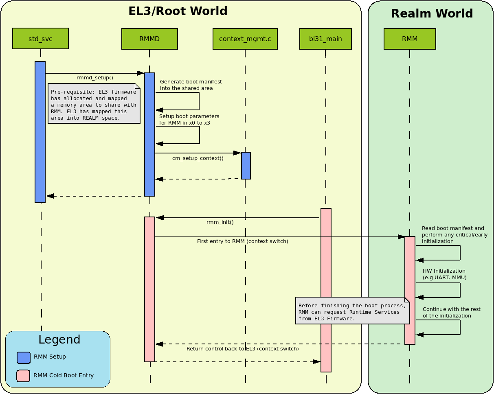
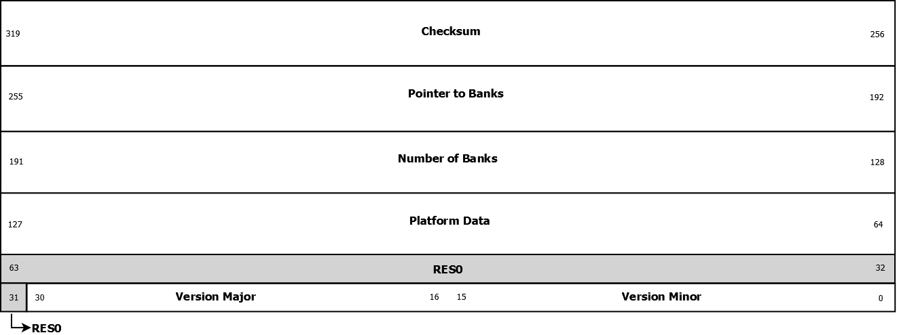

RMM-EL3 Communications interface
********************************

This document defines the communication interface between RMM and EL3.
There are two parts in this interface: the boot interface and the runtime
interface.

The Boot Interface defines the ABI between EL3 and RMM when the CPU enters
R-EL2 for the first time after boot. The cold boot interface defines the ABI
for the cold boot path and the warm boot interface defines the same for the
warm path.

The RMM-EL3 runtime interface defines the ABI for EL3 services which can be
invoked by RMM.

The below sections discuss these interfaces more in detail.

.. _rmm_el3_ifc_versioning:

RMM-EL3 Interface versioning
____________________________

The RMM Boot and Runtime Interfaces use a versioning system to check the
compatibility with the arguments passed by RMMD at boot time in the case
of the Boot Interface and the RMM-EL3 services specification, in the case
of the Runtime Interface.

The Boot Manifest, discussed later in section :ref:`rmm el3 boot manifest`,
uses the same versioning system, however, its number version is not tied to
that of the Boot Interface ABI.

The version number is casted in a 32-bit type, with the following configuration:

.. csv-table::
   :header: "Bits", "Value"

   [0:15],``VERSION_MINOR``
   [16:30],``VERSION_MAJOR``
   [31],RES0

The fields of the version number are described as follows:

  - ``VERSION_MAJOR``: This value is increased when the changes on the Boot
    Interface ABI and or on the RMM-EL3 services specification break
    compatibility with previous versions, for instance
    when new mandatory arguments are introduced or removed. If the changes
    on the ABI are compatible with the previous ABI, ``VERSION_MAJOR``
    remains unchanged.

  - ``VERSION_MINOR``: This value is increased on any change on the Boot
    Interface ABI or the RMM-EL3 services specification that is backwards
    compatible with the previous version and does not break compatibility.
    When ``VERSION_MAJOR`` is increased, ``VERSION_MINOR`` must be set to 0.

This document specifies the 0.1 version of Boot Interface ABI and RMM-EL3
services specification and the 0.1 version of the Boot Manifest.

.. _rmm el3 boot interface:

RMM Boot Interface
__________________

As mentioned above, this section deals with the Boot Interface part of the
section.

One of the goals of the Boot Interface is to allow EL3 firmware to pass
down into RMM certain platform specific information dynamically. This allows
RMM to be less platform dependent and be more generic accross platform
variations. The Boot Interface ABI defines a set of register conventions and
also a memory based manifest file to pass information from EL3 to RMM. Both
the register convention and the manifest are versioned separately to manage
future enhancements and compatibility.

RMM completes the boot by issuing the ``RMM_BOOT_COMPLETE`` SMC (0xC40001CF)
back to EL3. After the boot interface is completed, RMM can only be entered
by EL3 for handling RMI.

If RMM returns an error during boot, then RMM must not be entred by EL3 on
any CPU.

.. _rmm_cold_boot_interface:

Cold Boot Interface
~~~~~~~~~~~~~~~~~~~

During cold boot RMM expects the following register values:

.. csv-table::
   :header: "Register", "Value"
   :widths: 1, 5

   x0,Linear index of this PE. This index starts from 0 and must be less or equal than the maximum supported number of CPUs in the RMM build.
   x1,Version for this Boot Interface as defined in :ref:`rmm_el3_ifc_versioning`. The version defines both cold and warm paths
   x2,``PLATFORM_CORE_COUNT``. See :ref:`platform_def_mandatory`
   x3,Base address for the shared buffer used for communication between EL3 firmware and RMM. This buffer must be of 4KB size (1 page). The boot manifest must be present at the base of this shared buffer during cold boot
   x4 - x7,RES0

During cold boot, EL3 firmware needs to allocate a 4K page that will be
passed to RMM in x3. This memory will be used as shared buffer for communication
between EL3 and RMM. It must be assigned to Realm world and must be mapped with
Normal memory attributes at EL3. At boot, this memory will be used to populate
the Boot Manifest. Since the Boot Manifest can be accessed by RMM prior to
enabling its MMU, EL3 must ensure that proper cache maintenance operations are
performed after the Boot Manifest is populated.

EL3 should also ensure that this shared buffer is always available for use by RMM
during the lifetime of the system and that it can be used for runtime
communication between RMM and EL3. For example, when RMM invokes attestation
service commands in RMMD, this buffer can be used to exchange data between RMM
and EL3. It is also allowed for RMM to invoke runtime services provided by RMMD
utilizing this buffer during the boot phase, prior to return back to EL3.

RMM should map this memory page into its Stage 1 page-tables using Normal
memory attributes.

During runtime, it is the RMM which initiates any communication with EL3. If that
communication requires the use of the shared area, it is expected that RMM needs
to do the necessary concurrency protection to prevent the use of the same buffer
by other PEs.

The following sequence diagram shows the cold boot interface between RMM and
TF-A EL3 runtime firmware.

Warm Boot Interface
~~~~~~~~~~~~~~~~~~~

At warm boot, RMM is already initialized and only some per-CPU initialization
is still pending. The only argument that is required by RMM at this stage is
the CPU Id, which will be passed through register x0. X1 to x7 are RES0. This
is summarized in the following table:

.. csv-table::
   :header: "Register", "Value"
   :widths: 1, 5

   x0,Linear index of this PE. This index starts from 0 and must be less or equal than the maximum supported number of CPUs in the RMM build.
   x1 - x7,RES0

Boot error handling and return values
~~~~~~~~~~~~~~~~~~~~~~~~~~~~~~~~~~~~~

After boot up and initialization, RMM retuns control back to RMMD through a
``RMM_BOOT_COMPLETE`` SMC call. The only argument on this SMC call will
be returned on x1 and it will encode a signed integer with the error reason
as per the following table:

.. csv-table::
   :header: "Error code", "Description", "ID"
   :widths: 2 4 1

   ``E_RMM_BOOT_SUCCESS``,Boot successful,0
   ``E_RMM_BOOT_VERSION_NOT_VALID``,Boot Interface version reported by RMMD is not supported by RMM,-1
   ``E_RMM_BOOT_CPUS_OUT_OF_RAGE``,Number of CPUs reported by RMMD lager than maximum supported by RMM,-2
   ``E_RMM_BOOT_CPU_ID_OUT_OF_RAGE``,Current CPU Id is higher than the maximum reported by RMMD,-3
   ``E_RMM_BOOT_INVALID_SHARED_BUFFER``,Invalid pointer to shared memory area,-4
   ``E_RMM_BOOT_MANIFEST_VERSION_NOT_SUPPORTED``,Version reported by the boot manifest not supported by RMM,-5
   ``E_RMM_BOOT_MANIFEST_DATA_ERROR``,Error parsing core boot manifest,-6
   ``RMM_BOOT_ERR_UNKNOWN``,Unknown error,-7

For any error detected in RMM during cold or warm boot, RMM will return back to
RMMD using ``RMM_BOOT_COMPLETE`` with an appropriate error code. It is expected
that EL3 will take necessary action to disable Realm world for further entry
from NS Host on receiving an error. This will be done accross all the PEs in
the system so as to present a symmetric view to the NS Host. Any further warm
boot by any PE should not enter RMM using the warm boot interface.

.. _rmm el3 boot manifest:

Boot Manifest
~~~~~~~~~~~~~

During cold boot, EL3 Firmware passes a memory boot manifest to RMM containing
platform information.

This boot manifest is versioned independently of the boot interface, to help
future enhancements and compatibility. The current version for the boot
manifest is ``v0.1`` and the same set of rules explained on
:ref:`rmm_el3_ifc_versioning` apply on it as well.

The boot manifest is divided into two different components:

   - Core Manifest: This is a contract between RMM and the EL3 Firmware and, for TF-A is defined as part of RMMD. It contains parameters common to all platforms.
   - Platform data: This is defined by the platform owner and contains information specific to that platform.

For the current version of the manifest, the core manifest contains a pointer
to the platform data. EL3 FW must ensure that the whole boot manifest,
including the platform data if available, fits inside the RMM EL3 shared area.
For the specific case of TF-A, there are a number of helper functions to help
enforcing this which should be used by any platform implementer needing to
create platform data.

.. code:: c

   /* Accessors for the manifest platform data */
   int rmmd_set_platform_manifest_data(uintptr_t core_manifest,
						  uintptr_t platform_manifest)
   {
      ...
   }

   uintptr_t rmmd_get_platform_manifest_data(uintptr_t core_manifest)
   {
      ...
   }

   /*
    * This function searches for the next 8-byte aligned address after
    * the core manifest that can be used to store the platform manifest
    * data. It assings that address to the plat_data field of the
    * core manifest passed on the argument.
    *
    * Return: The address used for the platform manifest.
    */
   uintptr_t rmmd_allocate_platform_manifest(uintptr_t core_manifest)
   {
      ...
   }

For the formal specification of the RMM Boot Manifest v0.1, refer to
:ref:`rmm_el3_manifest_struct`

Runtime services and interface
______________________________

This section defines the RMM-EL3 runtime interface which specifies the ABI for
EL3 services expected by RMM at runtime. It is important to note that RMM is
allowed to invoke EL3-RMM runtime interface services during the boot phase as
well. The EL3 runtime service handling must not result in a world switch to
another world. Both the RMM and RMMD are allowed to make suitable optimizations
based on this assumption.

If the interface requires the use of memory, then the memory references should
be within the shared buffer communicated as part of the boot interface. See
:ref:`rmm_cold_boot_interface` for properties of this shared buffer which both
EL3 and RMM must adhere to.

RMM <-> EL3 command return codes
~~~~~~~~~~~~~~~~~~~~~~~~~~~~~~~~

The return codes from EL3 to RMM is a 32 bit signed integer wich encapsulates
error condition as described in the following table:

.. csv-table::
   :header: "Error code", "Description", "ID"
   :widths: 2 4 1

   ``E_RMM_OK``,No errors detected,0
   ``E_RMM_BAD_ADDR``,The value of an address used as argument was invalid,-2
   ``E_RMM_BAD_PAS``,Incorrect PAS,-3
   ``E_RMM_NOMEM``,Not enough memory to perform an operation,-4
   ``E_RMM_INVAL``,The value of an argument was invalid,-5
   ``E_RMM_UNK``,Unknown/Generic error,-6

Multiple failure conditions in an RMM to EL3 command may return the same error code.

RMM Runtime commands
~~~~~~~~~~~~~~~~~~~~

The following table summarizes the RMM runtime services that need to be
implemented by EL3 Firmware.

.. csv-table::
   :header: "FID", "Command"
   :widths: 2 5

   0xC40001B2,``RMM_ATTEST_GET_REALM_KEY``
   0xC40001B3,``RMM_ATTEST_GET_PLAT_TOKEN``

RMM_ATTEST_GET_REALM_KEY command
================================

Retrieve the Platform Token from EL3.

FID
---

``0xC40001B2``

Input values
------------

.. csv-table::
   :header: "Name", "Register", "Field", "Type", "Description"
   :widths: 1 1 1 1 5

   FID,x0,[63:0],UInt64,Command FID
   PA,x1,[63:0],Address,PA where to store the Realm Attestation Key. The PA must belong to the shared buffer
   BSize,x2,[63:0],Size,Size in bytes of the Realm Attestation Key buffer
   Curve,x3,[63:0],Enum,Type of the elliptic curve to which the requested attestation key belogs to. See :ref:`ecc_curves`

Output values
-------------

.. csv-table::
   :header: "Name", "Register", "Field", "Type", "Description"
   :widths: 1 1 1 1 5

   Result,x0,[63:0],Error Code,Command return status
   PTSize,x1,[63:0],Size,Size of the Realm Attestation Key

Failure conditions
------------------

The table below shows all the possible error codes returned in ``Result`` upon
a failure. The errors are ordered by condition check.

.. csv-table::
   :header: "ID", "Condition"
   :widths: 1 5

   ``E_RMM_BAD_ADDR``,``PA`` is outside the shared buffer
   ``E_RMM_INVAL``,``PA + BSize`` is outside the shared buffer
   ``E_RMM_INVAL``,``Curve`` is not one of the listed in :ref:`ecc_curves`
   ``E_RMM_UNK``,An unknown error occurred whilst processing the command
   ``E_RMM_OK``,No errors detected

.. _ecc_curves:

Supported ECC Curves
--------------------

.. csv-table::
   :header: "ID", "Curve"
   :widths: 1 5

   0,ECC SECP384R1

RMM_ATTEST_GET_PLAT_TOKEN command
=================================

Retrieve the Platform Token from EL3.

FID
---

``0xC40001B3``

Input values
------------

.. csv-table::
   :header: "Name", "Register", "Field", "Type", "Description"
   :widths: 1 1 1 1 5

   FID,x0,[63:0],UInt64,Command FID
   PA,x1,[63:0],Address,PA of the platform attestation token. The challenge object is passed in this buffer. The PA must belong to the shared buffer
   BSize,x2,[63:0],Size,Size in bytes of the platform attestation token buffer
   CSize,x3,[63:0],Size,Size in bytes of the challenge object. It corresponds to the size of one of the defined SHA algorithms

Output values
-------------

.. csv-table::
   :header: "Name", "Register", "Field", "Type", "Description"
   :widths: 1 1 1 1 5

   Result,x0,[63:0],Error Code,Command return status
   PTSize,x1,[63:0],Size,Size of the platform token

Failure conditions
------------------

The table below shows all the possible error codes returned in ``Result`` upon
a failure. The errors are ordered by condition check.

.. csv-table::
   :header: "ID", "Condition"
   :widths: 1 5

   ``E_RMM_BAD_ADDR``,``PA`` is outside the shared buffer
   ``E_RMM_INVAL``,``PA + BSize`` is outside the shared buffer
   ``E_RMM_INVAL``,``CSize`` does not represent the size of a supported SHA algorithm
   ``E_RMM_UNK``,An unknown error occurred whilst processing the command
   ``E_RMM_OK``,No errors detected

RMM <--> EL3 world switch register convention
_____________________________________________

As part of world switch, EL3 is expected to maintain a register context
specific to each world and will save and restore the registers
appropriately. This section captures the contract between EL3 and RMM on the
register set to be saved and restored.

EL3 must maintain a separate register context for the following:

   #. General purpose registers (x0-x30) and ``sp_el0``, ``sp_el2`` stack pointers
   #. EL2 system register context for all enabled features by EL3. These include system registers with the ``_EL2`` prefix. The EL2 physical and virtual timer register must not be included in this.

It is the responsibility of EL3 that the above registers will not be leaked to
the NS Host and to maintain the confidentiality of the Realm World.

EL2 will not save some registers as mentioned in the below list. It is the
responsibility of RMM to ensure that these are appropriately saved if the
Realm World makes use of them:

   #. FP/SIMD registers
   #. SVE registers
   #. SME registers
   #. EL1/0 registers

SMCCC v1.3 allows NS world to specify whether SVE context is in use. In this
case, RMM needs not to save the incoming SVE context but must ensure to clear
SVE registers if they have been used in Realm World. The same applies to SME
registers.

Types
_____

.. _rmm_el3_manifest_struct:

RMM-EL3 Boot Manifest Version 1.0
~~~~~~~~~~~~~~~~~~~~~~~~~~~~~~~~~

The RMM-EL3 Boot Manifest structure contains platform boot information passed
from EL3 to RMM. The width of the Boot Manifest is 128 bits

The members of the RMM-EL3 Boot Manifest structure are shown in the following
table:

.. csv-table::
   :header: "Name", "Range", "Type", Description
   :widths: 2 1 1 4

   ``Version Minor``,15:0,uint16_t,Version Minor part of the Boot Manifest Version.
   ``Version Major``,31:16,uint16_t,Version Major part of the Boot Manifest Version. MSB is RES0.
   ``Platform Data``,64:127,Address,Pointer to the Platform Data section of the Boot Manifest.

``Version Minor`` and ``Version Major`` can be packed together inside an
uint32_t type forming the Boot Manifest Version field.
