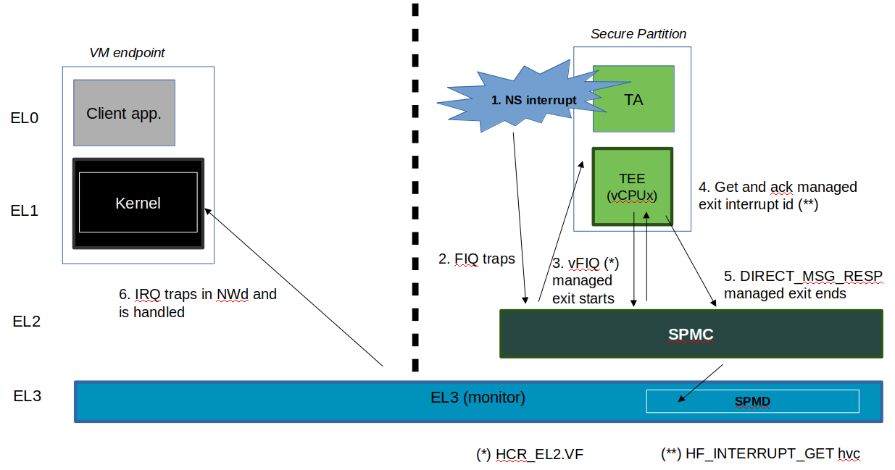
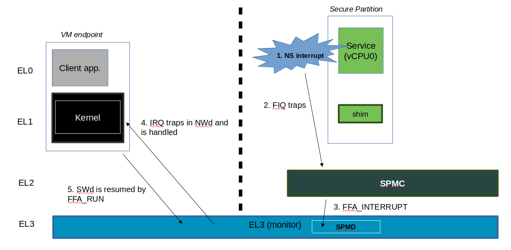
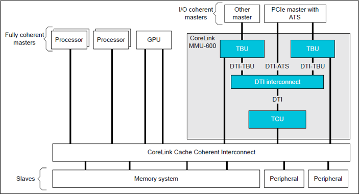

Secure Partition Manager
************************

.. contents::

Acronyms
========

+--------+-----------------------------------+
| CoT    | Chain of Trust                    |
+--------+-----------------------------------+
| DMA    | Direct Memory Access              |
+--------+-----------------------------------+
| DTB    | Device Tree Blob                  |
+--------+-----------------------------------+
| DTS    | Device Tree Source                |
+--------+-----------------------------------+
| EC     | Execution Context                 |
+--------+-----------------------------------+
| FIP    | Firmware Image Package            |
+--------+-----------------------------------+
| FF-A   | Firmware Framework for Armv8-A    |
+--------+-----------------------------------+
| IPA    | Intermediate Physical Address     |
+--------+-----------------------------------+
| NWd    | Normal World                      |
+--------+-----------------------------------+
| ODM    | Original Design Manufacturer      |
+--------+-----------------------------------+
| OEM    | Original Equipment Manufacturer   |
+--------+-----------------------------------+
| PA     | Physical Address                  |
+--------+-----------------------------------+
| PE     | Processing Element                |
+--------+-----------------------------------+
| PVM    | Primary VM                        |
+--------+-----------------------------------+
| SMMU   | System Memory Management Unit     |
+--------+-----------------------------------+
| SP     | Secure Partition                  |
+--------+-----------------------------------+
| SPM    | Secure Partition Manager          |
+--------+-----------------------------------+
| SPMC   | SPM Core                          |
+--------+-----------------------------------+
| SPMD   | SPM Dispatcher                    |
+--------+-----------------------------------+
| SiP    | Silicon Provider                  |
+--------+-----------------------------------+
| SWd    | Secure World                      |
+--------+-----------------------------------+
| TLV    | Tag-Length-Value                  |
+--------+-----------------------------------+
| TOS    | Trusted Operating System          |
+--------+-----------------------------------+
| VM     | Virtual Machine                   |
+--------+-----------------------------------+

Foreword
========

Two implementations of a Secure Partition Manager co-exist in the TF-A codebase:

- SPM based on the FF-A specification `[1]`_.
- SPM based on the MM interface to communicate with an S-EL0 partition `[2]`_.

Both implementations differ in their architectures and only one can be selected
at build time.

This document:

- describes the FF-A implementation where the Secure Partition Manager
  resides at EL3 and S-EL2 (or EL3 and S-EL1).
- is not an architecture specification and it might provide assumptions
  on sections mandated as implementation-defined in the specification.
- covers the implications to TF-A used as a bootloader, and Hafnium
  used as a reference code base for an S-EL2 secure firmware on
  platforms implementing the FEAT_SEL2 (formerly Armv8.4 Secure EL2)
  architecture extension.

Terminology
-----------

- The term Hypervisor refers to the NS-EL2 component managing Virtual Machines
  (or partitions) in the normal world.
- The term SPMC refers to the S-EL2 component managing secure partitions in
  the secure world when the FEAT_SEL2 architecture extension is implemented.
- Alternatively, SPMC can refer to an S-EL1 component, itself being a secure
  partition and implementing the FF-A ABI on platforms not implementing the
  FEAT_SEL2 architecture extension.
- The term VM refers to a normal world Virtual Machine managed by an Hypervisor.
- The term SP refers to a secure world "Virtual Machine" managed by an SPMC.

Support for legacy platforms
----------------------------

In the implementation, the SPM is split into SPMD and SPMC components.
The SPMD is located at EL3 and mainly relays FF-A messages from
NWd (Hypervisor or OS kernel) to SPMC located either at S-EL1 or S-EL2.

Hence TF-A supports both cases where the SPMC is located either at:

- S-EL1 supporting platforms not implementing the FEAT_SEL2 architecture
  extension. The SPMD relays the FF-A protocol from EL3 to S-EL1.
- or S-EL2 supporting platforms implementing the FEAT_SEL2 architecture
  extension. The SPMD relays the FF-A protocol from EL3 to S-EL2.

The same TF-A SPMD component is used to support both configurations.
The SPMC exception level is a build time choice.

Sample reference stack
======================

The following diagram illustrates a possible configuration when the
FEAT_SEL2 architecture extension is implemented, showing the SPMD
and SPMC, one or multiple secure partitions, with an optional
Hypervisor:

.. image:: ../resources/diagrams/ff-a-spm-sel2.png

TF-A build options
==================

This section explains the TF-A build options involved in building with
support for an FF-A based SPM where the SPMD is located at EL3 and the
SPMC located at S-EL1 or S-EL2:

- **SPD=spmd**: this option selects the SPMD component to relay the FF-A
  protocol from NWd to SWd back and forth. It is not possible to
  enable another Secure Payload Dispatcher when this option is chosen.
- **SPMD_SPM_AT_SEL2**: this option adjusts the SPMC exception
  level to being S-EL1 or S-EL2. It defaults to enabled (value 1) when
  SPD=spmd is chosen.
- **CTX_INCLUDE_EL2_REGS**: this option permits saving (resp.
  restoring) the EL2 system register context before entering (resp.
  after leaving) the SPMC. It is mandatorily enabled when
  ``SPMD_SPM_AT_SEL2`` is enabled. The context save/restore routine
  and exhaustive list of registers is visible at `[4]`_.
- **SP_LAYOUT_FILE**: this option specifies a text description file
  providing paths to SP binary images and manifests in DTS format
  (see `Specifying partition binary image and DT`_). It
  is required when ``SPMD_SPM_AT_SEL2`` is enabled hence when multiple
  secure partitions are to be loaded on behalf of the SPMC.

+---------------+----------------------+------------------+
|               | CTX_INCLUDE_EL2_REGS | SPMD_SPM_AT_SEL2 |
+---------------+----------------------+------------------+
| SPMC at S-EL1 |         0            |        0         |
+---------------+----------------------+------------------+
| SPMC at S-EL2 |         1            | 1 (default when  |
|               |                      |    SPD=spmd)     |
+---------------+----------------------+------------------+

Other combinations of such build options either break the build or are not
supported.

Notes:

- Only Arm's FVP platform is supported to use with the TF-A reference software
  stack.
- The reference software stack uses FEAT_PAuth (formerly Armv8.3-PAuth) and
  FEAT_BTI (formerly Armv8.5-BTI) architecture extensions by default at EL3
  and S-EL2.
- The ``CTX_INCLUDE_EL2_REGS`` option provides the generic support for
  barely saving/restoring EL2 registers from an Arm arch perspective. As such
  it is decoupled from the ``SPD=spmd`` option.
- BL32 option is re-purposed to specify the SPMC image. It can specify either
  the Hafnium binary path (built for the secure world) or the path to a TEE
  binary implementing FF-A interfaces.
- BL33 option can specify the TFTF binary or a normal world loader
  such as U-Boot or the UEFI framework.

Sample TF-A build command line when SPMC is located at S-EL1
(e.g. when the FEAT_EL2 architecture extension is not implemented):

.. code:: shell

    make \
    CROSS_COMPILE=aarch64-none-elf- \
    SPD=spmd \
    SPMD_SPM_AT_SEL2=0 \
    BL32=<path-to-tee-binary> \
    BL33=<path-to-bl33-binary> \
    PLAT=fvp \
    all fip

Sample TF-A build command line for a FEAT_SEL2 enabled system where the SPMC is
located at S-EL2:

.. code:: shell

    make \
    CROSS_COMPILE=aarch64-none-elf- \
    PLAT=fvp \
    SPD=spmd \
    CTX_INCLUDE_EL2_REGS=1 \
    ARM_ARCH_MINOR=5 \
    BRANCH_PROTECTION=1 \
    CTX_INCLUDE_PAUTH_REGS=1 \
    BL32=<path-to-hafnium-binary> \
    BL33=<path-to-bl33-binary> \
    SP_LAYOUT_FILE=sp_layout.json \
    all fip

Same as above with enabling secure boot in addition:

.. code:: shell

    make \
    CROSS_COMPILE=aarch64-none-elf- \
    PLAT=fvp \
    SPD=spmd \
    CTX_INCLUDE_EL2_REGS=1 \
    ARM_ARCH_MINOR=5 \
    BRANCH_PROTECTION=1 \
    CTX_INCLUDE_PAUTH_REGS=1 \
    BL32=<path-to-hafnium-binary> \
    BL33=<path-to-bl33-binary> \
    SP_LAYOUT_FILE=sp_layout.json \
    MBEDTLS_DIR=<path-to-mbedtls-lib> \
    TRUSTED_BOARD_BOOT=1 \
    COT=dualroot \
    ARM_ROTPK_LOCATION=devel_rsa \
    ROT_KEY=plat/arm/board/common/rotpk/arm_rotprivk_rsa.pem \
    GENERATE_COT=1 \
    all fip

FVP model invocation
====================

The FVP command line needs the following options to exercise the S-EL2 SPMC:

+---------------------------------------------------+------------------------------------+
| - cluster0.has_arm_v8-5=1                         | Implements FEAT_SEL2, FEAT_PAuth,  |
| - cluster1.has_arm_v8-5=1                         | and FEAT_BTI.                      |
+---------------------------------------------------+------------------------------------+
| - pci.pci_smmuv3.mmu.SMMU_AIDR=2                  | Parameters required for the        |
| - pci.pci_smmuv3.mmu.SMMU_IDR0=0x0046123B         | SMMUv3.2 modeling.                 |
| - pci.pci_smmuv3.mmu.SMMU_IDR1=0x00600002         |                                    |
| - pci.pci_smmuv3.mmu.SMMU_IDR3=0x1714             |                                    |
| - pci.pci_smmuv3.mmu.SMMU_IDR5=0xFFFF0472         |                                    |
| - pci.pci_smmuv3.mmu.SMMU_S_IDR1=0xA0000002       |                                    |
| - pci.pci_smmuv3.mmu.SMMU_S_IDR2=0                |                                    |
| - pci.pci_smmuv3.mmu.SMMU_S_IDR3=0                |                                    |
+---------------------------------------------------+------------------------------------+
| - cluster0.has_branch_target_exception=1          | Implements FEAT_BTI.               |
| - cluster1.has_branch_target_exception=1          |                                    |
+---------------------------------------------------+------------------------------------+
| - cluster0.restriction_on_speculative_execution=2 | Required by the EL2 context        |
| - cluster1.restriction_on_speculative_execution=2 | save/restore routine.              |
+---------------------------------------------------+------------------------------------+

Sample FVP command line invocation:

.. code:: shell

    <path-to-fvp-model>/FVP_Base_RevC-2xAEMv8A -C pctl.startup=0.0.0.0
    -C cluster0.NUM_CORES=4 -C cluster1.NUM_CORES=4 -C bp.secure_memory=1 \
    -C bp.secureflashloader.fname=trusted-firmware-a/build/fvp/debug/bl1.bin \
    -C bp.flashloader0.fname=trusted-firmware-a/build/fvp/debug/fip.bin \
    -C bp.pl011_uart0.out_file=fvp-uart0.log -C bp.pl011_uart1.out_file=fvp-uart1.log \
    -C bp.pl011_uart2.out_file=fvp-uart2.log \
    -C cluster0.has_arm_v8-5=1 -C cluster1.has_arm_v8-5=1 -C pci.pci_smmuv3.mmu.SMMU_AIDR=2 \
    -C pci.pci_smmuv3.mmu.SMMU_IDR0=0x0046123B -C pci.pci_smmuv3.mmu.SMMU_IDR1=0x00600002 \
    -C pci.pci_smmuv3.mmu.SMMU_IDR3=0x1714 -C pci.pci_smmuv3.mmu.SMMU_IDR5=0xFFFF0472 \
    -C pci.pci_smmuv3.mmu.SMMU_S_IDR1=0xA0000002 -C pci.pci_smmuv3.mmu.SMMU_S_IDR2=0 \
    -C pci.pci_smmuv3.mmu.SMMU_S_IDR3=0 \
    -C cluster0.has_branch_target_exception=1 \
    -C cluster1.has_branch_target_exception=1 \
    -C cluster0.restriction_on_speculative_execution=2 \
    -C cluster1.restriction_on_speculative_execution=2

Boot process
============

Loading Hafnium and secure partitions in the secure world
---------------------------------------------------------

TF-A BL2 is the bootlader for the SPMC and SPs in the secure world.

SPs may be signed by different parties (SiP, OEM/ODM, TOS vendor, etc.).
Thus they are supplied as distinct signed entities within the FIP flash
image. The FIP image itself is not signed hence this provides the ability
to upgrade SPs in the field.

Booting through TF-A
--------------------

SP manifests
~~~~~~~~~~~~

An SP manifest describes SP attributes as defined in `[1]`_ 
(partition manifest at virtual FF-A instance) in DTS format. It is
represented as a single file associated with the SP. A sample is
provided by `[5]`_. A binding document is provided by `[6]`_.

Secure Partition packages
~~~~~~~~~~~~~~~~~~~~~~~~~

Secure partitions are bundled as independent package files consisting
of:

- a header
- a DTB
- an image payload

The header starts with a magic value and offset values to SP DTB and
image payload. Each SP package is loaded independently by BL2 loader
and verified for authenticity and integrity.

The SP package identified by its UUID (matching FF-A uuid property) is 
inserted as a single entry into the FIP at end of the TF-A build flow
as shown:

.. code:: shell

    Trusted Boot Firmware BL2: offset=0x1F0, size=0x8AE1, cmdline="--tb-fw"
    EL3 Runtime Firmware BL31: offset=0x8CD1, size=0x13000, cmdline="--soc-fw"
    Secure Payload BL32 (Trusted OS): offset=0x1BCD1, size=0x15270, cmdline="--tos-fw"
    Non-Trusted Firmware BL33: offset=0x30F41, size=0x92E0, cmdline="--nt-fw"
    HW_CONFIG: offset=0x3A221, size=0x2348, cmdline="--hw-config"
    TB_FW_CONFIG: offset=0x3C569, size=0x37A, cmdline="--tb-fw-config"
    SOC_FW_CONFIG: offset=0x3C8E3, size=0x48, cmdline="--soc-fw-config"
    TOS_FW_CONFIG: offset=0x3C92B, size=0x427, cmdline="--tos-fw-config"
    NT_FW_CONFIG: offset=0x3CD52, size=0x48, cmdline="--nt-fw-config"
    B4B5671E-4A90-4FE1-B81F-FB13DAE1DACB: offset=0x3CD9A, size=0xC168, cmdline="--blob"
    D1582309-F023-47B9-827C-4464F5578FC8: offset=0x48F02, size=0xC168, cmdline="--blob"

.. uml:: ../resources/diagrams/plantuml/fip-secure-partitions.puml

Specifying partition binary image and DT
~~~~~~~~~~~~~~~~~~~~~~~~~~~~~~~~~~~~~~~~

A json-formatted description file is passed to the build flow specifying paths
to the SP binary image and associated DTS partition manifest file. The latter
is processed by the dtc compiler to generate a DTS fed into the SP package.
This file also specifies the SP owner (as an optional field) identifying the
signing domain in case of dual root CoT.
The SP owner can either be the silicon or the platform provider. The
corresponding "owner" field value can either take the value of "SiP" or "Plat".
In absence of "owner" field, it defaults to "SiP" owner.

.. code:: shell

    {
        "tee1" : {
            "image": "tee1.bin",
             "pm": "tee1.dts",
             "owner": "SiP"
        },

        "tee2" : {
            "image": "tee2.bin",
            "pm": "tee2.dts",
            "owner": "Plat"
        }
    }

SPMC manifest
~~~~~~~~~~~~~

This manifest contains the SPMC *attribute* node consumed by the SPMD at boot
time. It implements `[1]`_ (SP manifest at physical FF-A instance) and serves
two different cases:

- The SPMC resides at S-EL1: the SPMC manifest is used by the SPMD to setup a
  SP that co-resides with the SPMC and executes at S-EL1 or Secure Supervisor
  mode.
- The SPMC resides at S-EL2: the SPMC manifest is used by the SPMD to setup
  the environment required by the SPMC to run at S-EL2. SPs run at S-EL1 or
  S-EL0.

.. code:: shell

    attribute {
        spmc_id = <0x8000>;
        maj_ver = <0x1>;
        min_ver = <0x0>;
        exec_state = <0x0>;
        load_address = <0x0 0x6000000>;
        entrypoint = <0x0 0x6000000>;
        binary_size = <0x60000>;
    };

- *spmc_id* defines the endpoint ID value that SPMC can query through
  ``FFA_ID_GET``.
- *maj_ver/min_ver*. SPMD checks provided version versus its internal
  version and aborts if not matching.
- *exec_state* defines the SPMC execution state (AArch64 or AArch32).
  Notice Hafnium used as a SPMC only supports AArch64.
- *load_address* and *binary_size* are mostly used to verify secondary
  entry points fit into the loaded binary image.
- *entrypoint* defines the cold boot primary core entry point used by
  SPMD (currently matches ``BL32_BASE``) to enter the SPMC.

Other nodes in the manifest are consumed by Hafnium in the secure world.
A sample can be found at [7]:

- The *hypervisor* node describes SPs. *is_ffa_partition* boolean attribute
  indicates a FF-A compliant SP. The *load_address* field specifies the load
  address at which TF-A loaded the SP package.
- *cpus* node provide the platform topology and allows MPIDR to VMPIDR mapping.
  Note the primary core is declared first, then secondary core are declared
  in reverse order.
- The *memory* node provides platform information on the ranges of memory
  available to the SPMC.

SPMC boot
~~~~~~~~~

The SPMC is loaded by BL2 as the BL32 image.

The SPMC manifest is loaded by BL2 as the ``TOS_FW_CONFIG`` image.

BL2 passes the SPMC manifest address to BL31 through a register.

At boot time, the SPMD in BL31 runs from the primary core, initializes the core
contexts and launches the SPMC (BL32) passing the SPMC manifest address through
a register.

Loading of SPs
~~~~~~~~~~~~~~

At boot time, BL2 loads SPs sequentially in addition to the SPMC as depicted
below:

.. uml:: ../resources/diagrams/plantuml/bl2-loading-sp.puml

Note this boot flow is an implementation sample on Arm's FVP platform.
Platforms not using TF-A's *Firmware CONFiguration* framework would adjust to a
different implementation.

Secure boot
~~~~~~~~~~~

The SP content certificate is inserted as a separate FIP item so that BL2 loads SPMC,
SPMC manifest and secure partitions and verifies them for authenticity and integrity.
Refer to TBBR specification `[3]`_.

The multiple-signing domain feature (in current state dual signing domain `[8]`_) allows
the use of two root keys namely S-ROTPK and NS-ROTPK:

- SPMC (BL32) and SPMC manifest are signed by the SiP using the S-ROTPK.
- BL33 may be signed by the OEM using NS-ROTPK.
- An SP may be signed either by SiP (using S-ROTPK) or by OEM (using NS-ROTPK).

Refer to `Specifying partition binary image and DT`_ and `TF-A build options`_ for sample build command lines.

Hafnium in the secure world
===========================

General considerations
----------------------

Build platform for the secure world
~~~~~~~~~~~~~~~~~~~~~~~~~~~~~~~~~~~

In the Hafnium reference implementation specific code parts are only relevant to
the secure world. Such portions are isolated in architecture specific files
and/or enclosed by a ``SECURE_WORLD`` macro.

Secure partitions CPU scheduling
~~~~~~~~~~~~~~~~~~~~~~~~~~~~~~~~

The FF-A v1.0 specification `[1]`_ provides two ways to relinquinsh CPU time to
secure partitions:

- By invocation of a direct message request by a NWd VM or another SP.
- By invocation of the FFA_RUN interface by a NWd VM or another SP.

Platform topology
~~~~~~~~~~~~~~~~~

The FF-A v1.0 specification `[1]`_  mandates the following SP types:

- Pinned MP SPs: an execution context id matches a physical PE id. MP SPs must
  implement the same number of ECs as the number of platform PEs.
  The *execution-ctx-count* can take the value of one or the number of PEs.
- Migratable UP SPs: a single execution context can run and be migrated on any
  physical PE. It declares a single EC in its SP manifest. An UP SP can receive
  a direct message request on any physical core. 

Parsing SP partition manifests
------------------------------

Hafnium consumes SP manifests as defined in `[1]`_ and `SP manifests`_.
Note the current implementation may not implement all optional fields.

The SP manifest may contain memory and device regions nodes.

- Memory regions are mapped in the SP Stage-2 translation regime at
  load time. A memory region node can specify RX/TX buffer regions in which
  case it is not necessary for an SP to explicitly call the ``FFA_RXTX_MAP``
  service.
- Device regions are mapped in SP Stage-2 translation regime as
  peripherals and possibly allocate additional resources (e.g. interrupts)

Base addresses for memory and device region nodes are IPAs provided SPMC
identity maps IPAs to PAs within SP Stage-2 translation regime.

Note: in the current implementation both VTTBR_EL2 and VSTTBR_EL2 point to the
same set of page tables. It is still open whether two sets of page tables shall
be provided per SP. The memory region node as defined in the specification
provides a memory security attribute hinting to map either to the secure or
non-secure stage-2 table if it exists.

Passing boot data to the SP
---------------------------

In the specification `[1]`_  the section "Protocol for passing data" defines a
method for passing boot data to SPs (not currently implemented).

Provided that the whole secure partition package image (see `Secure
Partition packages`_) is mapped to the SP's secure Stage-2 translation
regime, an SP can access its own manifest DTB blob and extract its partition
manifest properties.

SP Boot order
-------------

SP manifests provide an optional boot order attribute meant to resolve
dependencies such as an SP providing a service required to properly boot
another SP.

Boot phases
-----------

Primary core boot-up
~~~~~~~~~~~~~~~~~~~~

The SPMC performs its platform initializations then loads and creates
secure partitions based on SP packages and manifests. Then each secure
partition is launched in sequence (see `SP Boot order`_) on their primary
execution context.

Notice the primary physical core may not be core 0. Hence if the primary
core linear id is N, the 1:1 mapping requires MP SPs are launched using
EC[N] on PE[N] (see `Platform topology`_).

The SP's primary EC (or the EC used when the partition is booted)
exits through ``FFA_MSG_WAIT`` to indicate successful initialization.

Secondary physical core boot-up
~~~~~~~~~~~~~~~~~~~~~~~~~~~~~~~

Upon boot-up, the SPMC running on the primary core performs
implementation-defined SPMD service calls at secure physical FF-A instance
to register the secondary physical cores entry points and context information:

-  This is done through a direct message request invocation to the SPMD
   (``SET_ENTRY_POINT``). This service call does not wake-up the targeted
   core immediately. The secondary core is woken up later by a NWd
   ``PSCI_CPU_ON`` service invocation. A notification is passed from EL3
   PSCI layer to the SPMD, and then to SPMC through an implementation-defined
   interface.
-  The SPMC/SPMD interface can consist of FF-A direct message requests/responses
   transporting PM events.

If there is no Hypervisor, the OS Kernel issues
``PSCI_CPU_ON`` calls that are directly trapped to EL3.

When a secondary physical core wakes-up the SPMD notifies the SPMC which updates
its internal states reflecting current physical core is being turned on.
It might then return straight to the SPMD and then to the NWd.

*(under discussion)* There may be possibility that an SP registers "PM events"
(during primary EC boot stage) through an ad-hoc interface. Such events would
be relayed by SPMC to one or more registered SPs on need basis
(see `Power management`_).

Secondary virtual core boot-up
~~~~~~~~~~~~~~~~~~~~~~~~~~~~~~

In the example case where Hafnium exists in the normal world, secondary VMs
issue a ``PSCI_CPU_ON`` service call which is trapped to the Hypervisor. The
latter then enables the vCPU context for the targeted core, and switches to
the PVM down to the kernel driver with an ``HF_WAKE_UP`` message. The NWd
driver in PVM can then schedule the newly woken up vCPU context.

In the secure world the primary EC of a given SP passes the secondary EC entry
point and context. The SMC service call is trapped into the SPMC. This can be
either *(under discussion)*:

-  a specific interface registering the secondary EC entry point,
   similarly to above ``SET_ENTRY_POINT`` service.
-  Re-purposing the ``PSCI_CPU_ON`` function id. It is
   assumed that even if the input arguments are the same as the ones defined in
   the PSCI standard, the usage deviates by the fact the secondary EC is not
   woken up immediately. At least for the FF-A v1.0 where only
   direct messaging is allowed, it is only after the first direct
   message invocation that the secondary EC is entered. This option
   might be preferred when the same code base is re-used for a VM or
   an SP. The ABI to wake-up a secondary EC can remain similar.

SPs are always scheduled from the NWd, this paradigm did not change from legacy
TEEs. There must always be some logic (or driver) in the NWd to relinquish CPU
cycles to the SWd. If primary core is 0, an SP EC[x>0] entry point is supplied
by the SP EC[0] when the system boots in SWd. But this EC[x] is not immediately
entered at boot. Later in the boot process when NWd is up, a direct message
request issued from physical core 1 ends up in SP EC[1], and only at this stage
this context is effectively scheduled.

It should be possible for an SP to call into another SP through direct message
provided the latter SP has been booted already. The "boot-order" field in
partition manifests (`SP Boot order`_) fulfills the dependency towards availability
of a service within an SP offered to another SP.

Mandatory interfaces
--------------------

The following interfaces must be exposed to any VM or SP:

-  ``FFA_STATUS``
-  ``FFA_ERROR``
-  ``FFA_INTERRUPT``
-  ``FFA_VERSION``
-  ``FFA_FEATURES``
-  ``FFA_RX_RELEASE``
-  ``FFA_RXTX_MAP``
-  ``FFA_RXTX_UNMAP``
-  ``FFA_PARTITION_INFO_GET``
-  ``FFA_ID_GET``

FFA_VERSION
~~~~~~~~~~~

Per `[1]`_ section 8.1 ``FFA_VERSION`` requires a
*requested_version* parameter from the caller.

In the current implementation when ``FFA_VERSION`` is invoked from:

-  Hypervisor in NS-EL2: the SPMD returns the SPMC version specified
   in the SPMC manifest.
-  OS kernel in NS-EL1 when NS-EL2 is not present: the SPMD returns the
   SPMC version specified in the SPMC manifest.
-  VM in NWd: the Hypervisor returns its implemented version.
-  SP in SWd: the SPMC returns its implemented version.
-  SPMC at S-EL1/S-EL2: the SPMD returns its implemented version.

FFA_FEATURES
~~~~~~~~~~~~

FF-A features may be discovered by secure partitions while booting
through the SPMC. However, SPMC cannot get features from Hypervisor
early at boot time as NS world is not setup yet.

The Hypervisor may decide to gather FF-A features from SPMC through SPMD
once at boot time and store the result. Later when a VM requests FF-A
features, the Hypervisor can adjust its own set of features with what
SPMC advertised, if necessary. Another approach is to always forward FF-A
features to the SPMC when a VM requests it to the Hypervisor. Although
the result is not supposed to change over time so there may not be added
value doing the systematic forwarding.

FFA_RXTX_MAP/FFA_RXTX_UNMAP
~~~~~~~~~~~~~~~~~~~~~~~~~~~

The RX/TX map API maps the send and receive buffer IPAs to the SP Stage-2 translation
regime.

The Hypervisor defines VMs and their attributes as logical structures,
including a mailbox used for FF-A indirect messaging, memory sharing, or the
`FFA_PARTITION_INFO_GET`_  ABI. This same mailbox structure is re-used in the
SPMC. `[1]`_ states only direct messaging is allowed to SPs. Thus mailbox usage
is restricted to implementing `FFA_PARTITION_INFO_GET`_ and memory sharing ABIs.

Note:
-  FFA_RXTX_UNMAP is not implemented in current Hafnium reference code base.

FFA_PARTITION_INFO_GET
~~~~~~~~~~~~~~~~~~~~~~

Partition info get service call can originate:

-  from SP to SPM
-  from VM to Hypervisor
-  from Hypervisor to SPM

For the latter case, the service call must be forwarded through the SPMD.

FFA_ID_GET
~~~~~~~~~~

The SPMD returns:

-  a default zero value on invocation from the Hypervisor.
-  The ``spmc_id`` value specified in the SPMC manifest on invocation from
   the SPMC (see `SPMC manifest`_)

The FF-A id space is split into a non-secure space and secure space:

-  FF-A id with bit 15 clear refer to normal world VMs.
-  FF-A id with bit 15 set refer to secure world SPs

Such convention helps the SPMC discriminating the origin and destination worlds
in an FF-A service invocation. In particular the SPMC shall filter unauthorized
transactions in its world switch routine. It must not be permitted for a VM to
use a secure FF-A id as origin world through spoofing:

-  A VM-to-SP messaging passing shall have an origin world being non-secure
   (FF-A id bit 15 clear) and destination world being secure (FF-A id bit 15
   set).
-  Similarly, an SP-to-SP message shall have FF-A id bit 15 set for both origin
   and destination ids.

An incoming direct message request arriving at SPMD from NWd is forwarded to
SPMC without a specific check. The SPMC is resumed through eret and "knows" the
message is coming from normal world in this specific code path. Thus the origin
endpoint id must be checked by SPMC for being a normal world id.

An SP sending a direct message request must have bit 15 set in its origin
endpoint id and this can be checked by the SPMC when the SP invokes the ABI.

The SPMC shall reject the direct message if the claimed world in origin endpoint
id is not consistent:

-  It is either forwarded by SPMD and thus origin endpoint id must be a "normal
   world id",
-  or initiated by an SP and thus origin endpoint id must be a "secure world id".

Direct messaging
----------------

This is a mandatory interface for secure partitions consisting in direct
message request and responses.

The ``ffa_handler`` Hafnium function may:

-  trigger a world change e.g. when an SP invokes the direct message
   response ABI to a VM.
-  handle multiple requests from the NWd without resuming an SP.

SP-to-SP
~~~~~~~~

-  An SP can send a direct message request to another SP
-  An SP can receive a direct message response from another SP.

VM-to-SP
~~~~~~~~

-  A VM can send a direct message request to an SP
-  An SP can send a direct message response to a VM

SPMC-SPMD messaging
~~~~~~~~~~~~~~~~~~~

Specific implementation-defined endpoint IDs are allocated to the SPMC and SPMD.
Referring those IDs in source/destination fields of a direct message
request/response permits SPMD to SPMC messaging back and forth.

Per `[1]`_ Table 114 Config No. 1 (physical FF-A instance):

-  SPMC=>SPMD direct message request uses SMC conduit
-  SPMD=>SPMC direct message request uses ERET conduit

Per `[1]`_ Table 118 Config No. 1 (physical FF-A instance):

-  SPMC=>SPMD direct message response uses SMC conduit
-  SPMD=>SPMC direct message response uses ERET conduit

Optional interfaces
-------------------

TODO: MEM_SHARE/MEM_LEND/MEM_DONATE

Memory management
-----------------

This section only deals with the PE MMU configuration.

Hafnium in the normal world deals with NS buffers only and provisions
a single root page table directory to VMs. In context of S-EL2 enabled
firmware, two IPA spaces are output from Stage-1 translation (secure
and non-secure). The Stage-2 translation handles:

-  A single secure IPA space when an SP Stage-1 MMU is disabled.
-  Two IPA spaces (secure and non-secure) when Stage-1 MMU is enabled.

``VTCR_EL2`` and ``VSTCR_EL2`` provide additional bits for controlling the
NS/S IPA translations (``VSTCR_EL2.SW``, ``VSTCR_EL2.SA``, ``VTCR_EL2.NSW``,
``VTCR_EL2.NSA``). There may be two approaches:

-  secure and non-secure mappings are rooted as two separate root page
   tables
-  secure and non-secure mappings use the same root page table. Access
   from S-EL1 to an NS region translates to a secure physical address
   space access.

Interrupt management
--------------------

Non-secure interrupt handling
~~~~~~~~~~~~~~~~~~~~~~~~~~~~~

The following pictures describe the scenarios of non secure physical interrupts
trapped by the SPMC for the cases where a SP handles the managed exit operation
or not:

Secure interrupt handling
~~~~~~~~~~~~~~~~~~~~~~~~~

The current implementation does not support handling of secure interrupts
trapped by the SPMC at S-EL2. This is work in progress planned for future
iterations.

Road to a para-virtualized interface
~~~~~~~~~~~~~~~~~~~~~~~~~~~~~~~~~~~~

Current Hafnium implementation uses an ad-hoc mechanism for a VM to get
a pending interrupt number through an hypercall. The PVM injects
interrupts to VMs by delegation from the Hypervisor. The PVM probes a
pending interrupt directly from the GIC distributor.

The short-term plan is to have Hafnium/SPMC in the secure world owner
of the GIC configuration.

The SPMC fully owns the GIC configuration at S-EL2. The SPMC manages
interrupt resources and allocates interrupt ID based on SP manifests.
The SPMC acknowledges physical interrupts and injects virtual interrupts
by setting the vIRQ bit when resuming a SP. A secure partition gathers
the interrupt number through an hypercall.

Notice the SPMC/SPMD has to handle Group0 secure interrupts in addition
to Group1 S/NS interrupts.

Power management
----------------

Assumption on the Nwd:

-  NWd is the best candidate to own the platform Power Management
   policy. It is master to invoking PSCI service calls from physical
   CPUs.
-  EL3 monitor is in charge of the PM control part (its PSCI layer
   actually writing to platform registers).
-  It is fine for the Hypervisor to trap PSCI calls and relay to EL3, or
   OS kernel driver to emit PSCI service calls.

PSCI notification are relayed through the SPMD/SPD PM hooks to the SPMC.
This can either be through re-use of PSCI FIDs or an FF-A direct message
from SPMD to SPMC.

The SPMD performs an exception return to the SPMC which is resumed to
its ``eret_handler`` routine. It is then either consuming a PSCI FID or
an FF-A FID. Depending on the servicing, the SPMC may return directly to
the SPMD (and then NWd) without resuming an SP at this stage. An example
of this is invocation of ``FFA_PARTITION_INFO_GET`` from NWd relayed by
the SPMD to the SPMC. The SPMC returns the needed partition information
to the SPMD (then NWd) without actually resuming a partition in secure world.

*(under discussion)*
About using PSCI FIDs from SPMD to SPMC to notify of PM events, it is still
questioned what to use as the return code from the SPMC.
If the function ID used by the SPMC is not an FF-A ID when doing SMC, then the
EL3 std svc handler won't route the response to the SPMD. That's where comes the
idea to embed the notification into an FF-A message. The SPMC can discriminate
this message as being a PSCI event, process it, and reply with an FF-A return
message that the SPMD receives as an acknowledgement.

SP notification
---------------

Power management notifications are conveyed from PSCI library to the
SPMD / SPD hooks. A range of events can be relayed to SPMC.

SPs may need to be notified about specific PM events.

-  SPs might register PM events to the SPMC
-  On SPMD to SPMC notification, a limited range of SPs may be notified
   through a direct message.
-  This assumes the mentioned SPs supports managed exit.

The SPMC is the first to be notified about PM events from the SPMD. It is up
to the SPMC to arbitrate to which SP it needs to send PM events.
An SP explicitly registers to receive notifications to specific PM events.
The register operation can either be an implementation-defined service call
to the SPMC when the primary SP EC boots, or be supplied through the SP
manifest.

Support for SMMUv3 in Hafnium
=============================

An SMMU is analogous to an MMU in a CPU. It performs address translations for
Direct Memory Access (DMA) requests from system I/O devices.
The responsibilities of an SMMU include:

-  Translation: Incoming DMA requests are translated from bus address space to
   system physical address space using translation tables compliant to
   Armv8/Armv7 VMSA descriptor format.
-  Protection: An I/O device can be prohibited from read, write access to a
   memory region or allowed.
-  Isolation: Traffic from each individial device can be independently managed.
   The devices are differentiated from each other using unique translation
   tables.

The following diagram illustrates a typical SMMU IP integrated in a SoC with
several I/O devices along with Interconnect and Memory system.

SMMU has several versions including SMMUv1, SMMUv2 and SMMUv3. Hafnium provides
support for SMMUv3 driver in both normal and secure world. A brief introduction
of SMMUv3 functionality and the corresponding software support in Hafnium is
provided here.

SMMUv3 features
---------------

-  SMMUv3 provides Stage1, Stage2 translation as well as nested (Stage1 + Stage2)
   translation support. It can either bypass or abort incoming translations as
   well.
-  Traffic (memory transactions) from each upstream I/O peripheral device,
   referred to as Stream, can be independently managed using a combination of
   several memory based configuration structures. This allows the SMMUv3 to
   support a large number of streams with each stream assigned to a unique
   translation context.
-  Support for Armv8.1 VMSA where the SMMU shares the translation tables with
   a Processing Element. AArch32(LPAE) and AArch64 translation table format
   are supported by SMMUv3.
-  SMMUv3 offers non-secure stream support with secure stream support being
   optional. Logically, SMMUv3 behaves as if there is an indepdendent SMMU
   instance for secure and non-secure stream support.
-  It also supports sub-streams to differentiate traffic from a virtualized
   peripheral associated with a VM/SP.
-  Additionally, SMMUv3.2 provides support for PEs implementing Armv8.4-A
   extensions. Consequently, SPM depends on Secure EL2 support in SMMUv3.2
   for providing Secure Stage2 translation support to upstream peripheral
   devices.

SMMUv3 Programming Interfaces
-----------------------------

SMMUv3 has three software interfaces that are used by the Hafnium driver to
configure the behaviour of SMMUv3 and manage the streams.

-  Memory based data strutures that provide unique translation context for
   each stream.
-  Memory based circular buffers for command queue and event queue.
-  A large number of SMMU configuration registers that are memory mapped during
   boot time by Hafnium driver. Except a few registers, all configuration
   registers have independent secure and non-secure versions to configure the
   behaviour of SMMUv3 for translation of secure and non-secure streams
   respectively.

Peripheral device manifest
--------------------------

Currently, SMMUv3 driver in Hafnium only supports dependent peripheral devices.
These devices are dependent on PE endpoint to initiate and receive memory
management transactions on their behalf. The acccess to the MMIO regions of
any such device is assigned to the endpoint during boot. Moreover, SMMUv3 driver
uses the same stage 2 translations for the device as those used by partition
manager on behalf of the PE endpoint. This ensures that the peripheral device
has the same visibility of the physical address space as the endpoint. The
device node of the corresponding partition manifest (refer to `[1]`_ section 3.2
) must specify these additional properties for each peripheral device in the
system :

-  smmu-id: This field helps to identify the SMMU instance that this device is
   upstream of.
-  stream-ids: List of stream IDs assigned to this device.

.. code:: shell

    smmuv3-testengine {
        base-address = <0x00000000 0x2bfe0000>;
        pages-count = <32>;
        attributes = <0x3>;
        smmu-id = <0>;
        stream-ids = <0x0 0x1>;
        interrupts = <0x2 0x3>, <0x4 0x5>;
        exclusive-access;
    };

SMMUv3 driver limitations
-------------------------

The primary design goal for the Hafnium SMMU driver is to support secure
streams.

-  Currently, the driver only supports Stage2 translations. No support for
   Stage1 or nested translations.
-  Supports only AArch64 translation format.
-  No support for features such as PCI Express (PASIDs, ATS, PRI), MSI, RAS,
   Fault handling, Performance Monitor Extensions, Event Handling, MPAM.
-  No support for independent peripheral devices.

References
==========

.. _[1]:

[1] `Arm Firmware Framework for Armv8-A <https://developer.arm.com/docs/den0077/latest>`__

.. _[2]:

[2] :ref:`Secure Partition Manager using MM interface<Secure Partition Manager (MM)>`

.. _[3]:

[3] `Trusted Boot Board Requirements
Client <https://developer.arm.com/docs/den0006/latest/trusted-board-boot-requirements-client-tbbr-client-armv8-a>`__

.. _[4]:

[4] https://git.trustedfirmware.org/TF-A/trusted-firmware-a.git/tree/lib/el3_runtime/aarch64/context.S#n45

.. _[5]:

[5] https://git.trustedfirmware.org/TF-A/tf-a-tests.git/tree/spm/cactus/plat/arm/fvp/fdts/cactus.dts

.. _[6]:

[6] https://trustedfirmware-a.readthedocs.io/en/latest/components/ffa-manifest-binding.html

.. _[7]:

[7] https://git.trustedfirmware.org/TF-A/trusted-firmware-a.git/tree/plat/arm/board/fvp/fdts/fvp_spmc_manifest.dts

.. _[8]:

[8] https://lists.trustedfirmware.org/pipermail/tf-a/2020-February/000296.html

--------------

*Copyright (c) 2020-2021, Arm Limited and Contributors. All rights reserved.*
