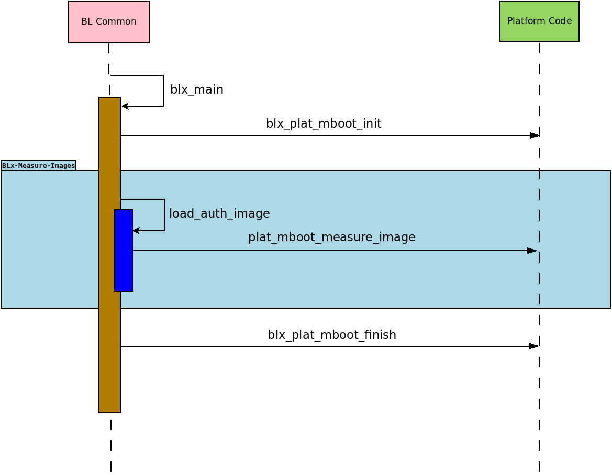

Measured Boot Design
====================

This document briefly explains about the Measured-Boot design implmenetation
in |TF-A|

Introduction
------------

Measured Boot is a boot flow that computes and securely records hashes of code
and critical data at each stage in the boot chain before the code/data is used.
The Measured Boot implementation in TF-A supports multiple backends to securely
store measurements mentioned below :ref:`Measured Boot Backends`.
These measurements can be used to enforce local attestation policies, such as
releasing certain platform keys or not.
The measurements can also be securely sent to a remote challenger aka verifier
after boot to attest to the state of the code and critical-data.

Measured Boot does not authenticate the code or critical-data, but simply
records what code/critical-data was present on the system during boot.

It is assumed that BL1 is implicitly trusted (by virtue of immutatibility) and
acts as the root of trust for measurement hence it is not measured.

Critical data
-------------

Critical data for the platform can decided by going through all below
criteria -

#. Data that influence boot flow behaviour such as -

   - Configuration parameters that alters boot flow path
   - Parameters decides to load different firmware from NV-Storage to
     SRAM/DRAM that eventually pass the boot process successfully.

#. Configuration settings, Debug settings and  security policies that need
   to be in a valid state for a device to maintain its security posture
   during boot and runtime.
#. Data that is being updated by hardware (un-deterministic data).

Measurement Slot
----------------

The Measurement Slot resides in a Trusted Module and can be either a secure
register or memory.
The Measuement Slot is used to provide a method to cryptographically record
(measure) software state: both the software running on a platform and
configuration data used by that software.
The Measurement Slot update calculation, called an extend, is a one-way
hash so that measurements can't be removed.

.. _Measured Boot Backends:

Measured Boot Backends
----------------------

Measured Boot implementation supports multiple backends -

#. Event Log -

   The TCG Event Log holds a record of measurements made into the Measurement
   Slot aka PCR (Platform Configuratiom Register).

   The `TCG PC Client Platform Firmware Profile Specification`_ provides
   details on how to measure components. The Arm document
   `Arm® Server Base Security Guide`_ provides specific guidance for
   measurements on an SBSA/SBBR server system. By considering these
   specifications it is decided that -

   #. Use PCR0 for images measurements.
   #. Use PCR1 for Critical data measurements.

   TCG has specified the architecture for the structure of this log in the
   `TCG EFI Protocol Specification`_. The specification describes two event
   log event records—the legacy, fixed size SHA1 structure called TCG_PCR_EVENT
   and the variable length crypto agile structure called TCG_PCR_EVENT2. Event
   Log driver implemented in TF-A covers later part.

#. RSS -

   It is one of physical backend to extend the measurements. Please refer this
   document :ref:`Runtime Security Subsystem (RSS)` for more details.

Platform Interface
------------------
Every image which gets successfully loaded in memory (and authenticated, if
trusted boot is enabled) then gets measured. In addition to that, platforms
can measure any relevant piece of critical data at any point during the boot.
The following diagram outlines the call sequence for Measured Boot platform
interfaces invoked from generic code:

Responsibilities of Measured Boot platform functions are -

#. **Function : blx_plat_mboot_init()**

   - Declared here:

     - ``include/plat/common/platform.h``

     .. code-block:: c

        void bl1_plat_mboot_init(void);
        void bl2_plat_mboot_init(void);

   - Initialise all Measured Boot backends supported by the platform
     (e.g. Event Log buffer, RSS).

   - On the Arm FVP port -

     - In BL1, This function is used to initialize the Event Log backend
       driver, and also to write header information in the Event Log
       buffer.
     - In BL2, this function is used to initialize Event Log buffer with
       the information received from the BL1. It results in panic on
       error.

#. **Function : plat_mboot_measure_image()**

   - Declared here:

     - ``include/plat/common/platform.h``

     .. code-block:: c

        int plat_mboot_measure_image(unsigned int image_id,
                                     image_info_t *image_data);

   - Measure the image with the help of crypto module by using the compile time
     defined hash algorithm of the backend.

   - Record the measurement in the corresponding backend -

     - If it is Event Log backend, then record the measurement in TCG Event Log
       format.
     - If it is hardware TPM (like RSS), then extend the designated PCR (or slot)
       with the given measurement.
   - On the Arm FVP port, this function measures the given image using its
     passed id and information and then records that measurement in the
     Event Log buffer.
   - This function must return 0 on success, a signed integer error code
     otherwise.

#. **Function : blx_plat_mboot_finish()**

   - Declared here:

     - ``include/plat/common/platform.h``

     .. code-block:: c

        void bl1_plat_mboot_finish(void);
        void bl2_plat_mboot_finish(void);

   - Do all teardown operations with respect to initialised Measured Boot backends.
     This could be -

     - Pass the Event Log details (start address and size) to Normal world or to
       Secure World using any platform implementation way.
     - Measure all critical data if any.

   - On the Arm FVP port -

     - In BL1, this function is used to pass the base address of
       the Event Log buffer and its size to BL2 via tb_fw_config to extend the
       Event Log buffer with the measurement of various images loaded by BL2.
       It results in panic on error.
     - In BL2, this function is used to pass the Event Log buffer information
       (base address and size) to non-secure(BL33) and trusted OS(BL32) via
       nt_fw and tos_fw config respectively. It results in panic on error.
       See :ref:`DTB binding for Event Log properties` for a description of the
       bindings used for Event Log properties.

#. **Function : plat_mboot_measure_critical_data()**

   - Declared here:

     - ``include/plat/common/platform.h``

     .. code-block:: c

        int plat_mboot_measure_critical_data(unsigned int critical_data_id,
                                             const void *base,
                                             size_t size);

   - plat_mboot_measure_critical_data. This interface is not invoked by the
     generic code and it is up to the platform layer to call it where
     appropriate.
   - This function measures the given critical data structure and records its
     measurement using the Measured Boot backend driver.
   - On the Arm FVP port, this function measures the given image using its
     passed id and information and then records that measurement in the
     Event Log buffer.
   - In FVP, Non volatile counters(Critical data) gets measured and recorded
     using the backend via this interface.
   - This function must return 0 on success, a signed integer error code
     otherwise.

These Measured Boot interfaces are used by BL1 and BL2 only. BL31 does not load and
thus does not measure any image.

--------------

*Copyright (c) 2023, Arm Limited. All rights reserved.*

.. _TCG PC Client Platform Firmware Profile Specification: https://trustedcomputinggroup.org/wp-content/uploads/EFI-Protocol-Specification-rev13-160330final.pdf
.. _Arm® Server Base Security Guide: https://developer.arm.com/documentation/den0086/latest
.. _TCG EFI Protocol Specification: https://trustedcomputinggroup.org/wp-content/uploads/EFI-Protocol-Specification-rev13-160330final.pdf
