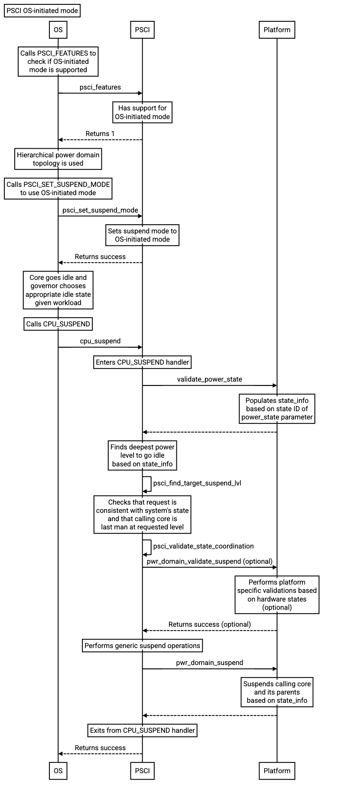

PSCI OS-initiated mode
======================

:Author: Wing Li
:Organization: Google LLC
:Contact: Wing Li <wingers@google.com>
:Status: RFC

.. contents:: Table of Contents

Introduction
------------

Power state coordination
^^^^^^^^^^^^^^^^^^^^^^^^

A power domain topology is a logical hierarchy of power domains in a system that
arises from the physical dependencies between power domains.

Entry into low-power states for a topology node above the core level requires
coordinating its children nodes. For example, in a system with a power domain
that encompasses a shared cache, and a separate power domain for each core that
uses the shared cache, the core power domains must be powered down before the
shared cache power domain can be powered down.

PSCI supports two modes of power state coordination: platform-coordinated and
OS-initiated.

Platform-coordinated
~~~~~~~~~~~~~~~~~~~~
In platform-coordinated mode, the platform is responsible for coordinating power
states, and chooses the deepest power state for a topology node that can be
tolerated by its children.

This is currently the only supported power state coordination mode in TF-A.

OS-initiated
~~~~~~~~~~~~
In OS-initiated mode, the calling OS is responsible for coordinating power
states, and only requests for a topology node to enter a low-power state when
its last child enters the low-power state.

It is optional for a platform to support OS-initiated mode.

Motivation
----------
OS-initiated mode allows the calling OS to have more precise control over the
entry, exit, and wakeup latencies when comparing and choosing various low-power
states for the cluster. This is especially important for multi-cluster SMP
systems and heterogeneous systems like big.LITTLE.

This document discusses the requirements and the proposed implementation to add
support for OS-initiated mode in TF-A.

Requirements
------------

PSCI_FEATURES
^^^^^^^^^^^^^
PSCI_FEATURES is for checking whether or not a PSCI function is implemented and
what its properties are.

Parameters

* Function ID

  * 0x8400_000A

* PSCI Function ID

  * The function ID of a PSCI function.

Return

* NOT_SUPPORTED, if the function is not implemented.
* A set of feature flags associated with the function, if the function is
  implemented.

CPU_SUSPEND feature flags

* Reserved, bits[31:2]
* Power state parameter format, bit[1]

  * A value of 0 indicates the original format is used.
  * A value of 1 indicates the extended format is used.

* OS-initiated mode, bit[0]

  * A value of 0 indicates OS-initiated mode is not supported.
  * A value of 1 indicates OS-initiated mode is supported.

See sections 5.1.14 and 5.15 of the PSCI spec (DEN0022D.b) for more details.

PSCI_SET_SUSPEND_MODE
^^^^^^^^^^^^^^^^^^^^^
PSCI_SET_SUSPEND_MODE is for switching between the two different modes of power
state coordination.

Parameters

* Function ID

  * 0x8400_000F

* Mode

  * A value of 0 indicates platform-coordinated mode.
  * A value of 1 indicates OS-initiated mode.

Return

* SUCCESS
* NOT_SUPPORTED
* INVALID_PARAMETERS
* DENIED

Switching from platform-coordinated to OS-initiated is only allowed if the
following conditions are met:

* All cores are in one of the following states:

  * Running.
  * Off, through a call to CPU_OFF or not yet booted.
  * Suspended, through a call to CPU_DEFAULT_SUSPEND.

* None of the cores has called CPU_SUSPEND since the last change of mode or
  boot.

Switching from OS-initiated to platform-coordinated is only allowed if all cores
other than the calling core are off, either through a call to CPU_OFF or not yet
booted.

If these conditions are not met, the PSCI implementation must return DENIED.

See sections 5.1.19 and 5.20 of the PSCI spec (DEN0022D.b) for more details.

CPU_SUSPEND
^^^^^^^^^^^
CPU_SUSPEND is for moving a topology node into a low-power state.

Parameters

* Function ID

  * 0xC400_0001

* Power State

  * Original Format

    * Power Level, bits[25:24]

      * The requested level in the power domain topology to enter a low-power
	state.

    * State Type, bit[16]

      * A value of 0 indicates a standby or retention state.
      * A value of 1 indicates a powerdown state.

    * State ID, bits[15:0]

      * Field to specify the requested composite power state.
      * The state ID encodings must uniquely describe every possible composite
	power state.
      * In OS-initiated mode, the state ID encoding must allow expressing the
	power level at which the calling core is the last to enter powerdown.

  * Extended Format

    * State Type, bit[30]
    * State ID, bits[27:0]

* Entry Point Address

  * Address at which the core must resume execution following wakeup from a
    powerdown state.

* Context ID

  * Field to specify a pointer to the saved context that must be restored on a
    core following wakeup from a powerdown state.

Return

* SUCCESS
* INVALID_PARAMETERS

  * In OS-initiated mode, this error is returned when a low-power state is
    requested for a topology node above the core level, and at least one of the
    node's children is in a local low-power state that is incompatible with the
    request.

* INVALID_ADDRESS
* DENIED

  * Only in OS-initiated mode. This error is returned when a low-power state is
    requested for a topology node above the core level, and at least one of the
    node's children is running, i.e. not in a low-power state.

In OS-initiated mode, the calling OS is making an explicit request for a
specific power state, as opposed to expressing a vote. The PSCI implementation
must comply with the request, unless the request is not consistent with the
implementation's view of the system's state, in which case, the implementation
must return INVALID_PARAMETERS or DENIED.

See sections 5.1.2 and 5.4 of the PSCI spec (DEN0022D.b) for more details.

Races in OS-initiated mode
~~~~~~~~~~~~~~~~~~~~~~~~~~
In OS-initiated mode, there are race windows where the OS's view and
implementation's view of the system's state differ. It is possible for the OS to
make requests that are invalid given the implementation's view of the system's
state. For example, the OS might request a powerdown state for a node from one
core, while at the same time, the implementation observes that another core in
that node is powering up.

To address potential race conditions in power state requests:

* The implementation must validate the CPU_SUSPEND request, and deny the request
  if the request is inconsistent with its view of the system's state.
* The calling OS must specify in each CPU_SUSPEND request the deepest power
  level for which it sees the calling core as the last running core (last man).

See sections 4.2.3.2, 6.2, and 6.3 of the PSCI spec (DEN0022D.b) for more
details.

Caveats
-------

CPU_OFF
^^^^^^^

CPU_OFF is always platform-coordinated, regardless of whether the power state
coordination mode for suspend is platform-coordinated or OS-initiated. If all
cores in a topology node call CPU_OFF, the last core will power down the node.

In OS-initiated mode, if a subset of the cores in a topology node has called
CPU_OFF, the last running core may call CPU_SUSPEND to request a powerdown state
at or above that node's power level.

See section 5.5.2 of the PSCI spec (DEN0022D.b) for more details.

Implementation
--------------

Current implementation of platform-coordinated mode
^^^^^^^^^^^^^^^^^^^^^^^^^^^^^^^^^^^^^^^^^^^^^^^^^^^
Platform-coordinated is currently the only supported power state coordination
mode in TF-A.

The functions of interest in the ``psci_cpu_suspend`` call stack are as follows:

* ``psci_validate_power_state``

  * This function calls a platform specific ``validate_power_state`` handler,
    which takes the ``power_state`` parameter, and updates the ``state_info``
    object with the requested states for each power level.

* ``psci_find_target_suspend_lvl``

  * This function takes the ``state_info`` object containing the requested power
    states for each power level, and returns the highest power level that was
    requested to enter a low power state, i.e. the target power level.

* ``psci_do_state_coordination``

  * This function takes the target power level and the ``state_info`` object
    containing the requested power states for each power level, and updates the
    ``state_info`` object with the coordinated target power state for each
    level.

* ``pwr_domain_suspend``

  * This is a platform specific handler that takes the ``state_info`` object
    containing the target power states for each power level, and transitions
    each power level to the specified power state.

Proposed implementation of OS-initiated mode
^^^^^^^^^^^^^^^^^^^^^^^^^^^^^^^^^^^^^^^^^^^^
To add support for OS-initiated mode, the following changes are proposed:

* Add a boolean build option ``PSCI_OS_INIT_MODE`` for a platform to enable
  optional support for PSCI OS-initiated mode. This build option defaults to 0.

Note: if ``PSCI_OS_INIT_MODE=0``, the following changes will not be compiled
into the build.

* Update ``psci_features`` to return 1 in bit[0] to indicate support for
  OS-initiated mode for CPU_SUSPEND.
* Define a ``suspend_mode`` enum: ``PLAT_COORD`` and ``OS_INIT``.
* Define a ``psci_suspend_mode`` global variable with a default value of
  ``PLAT_COORD``.
* Implement a new function handler ``psci_set_suspend_mode`` for
  PSCI_SET_SUSPEND_MODE.
* Since ``psci_validate_power_state`` calls a platform specific
  ``validate_power_state`` handler, the platform implementation should populate
  the ``state_info`` object based on the state ID from the given ``power_state``
  parameter.
* ``psci_find_target_suspend_lvl`` remains unchanged.
* Implement a new function ``psci_validate_state_coordination`` that ensures the
  request satisfies the following conditions, and denies any requests
  that don't:

  * The requested power states for each power level are consistent with the
    system's state
  * The calling core is the last core running at the requested power level

  This function differs from ``psci_do_state_coordination`` in that:

  * The ``psci_req_local_pwr_states`` map is not modified if the request were to
    be denied
  * The ``state_info`` argument is never modified since it contains the power
    states requested by the calling OS

* Update ``psci_cpu_suspend_start`` to do the following:

  * If ``PSCI_SUSPEND_MODE`` is ``PLAT_COORD``, call
    ``psci_do_state_coordination``.
  * If ``PSCI_SUSPEND_MODE`` is ``OS_INIT``, call
    ``psci_validate_state_coordination``. If validation fails, propagate the
    error up the call stack.

* Update the return type of the platform specific ``pwr_domain_suspend``
  handler from ``void`` to ``int``.

--------------

*Copyright (c) 2023, Arm Limited and Contributors. All rights reserved.*
