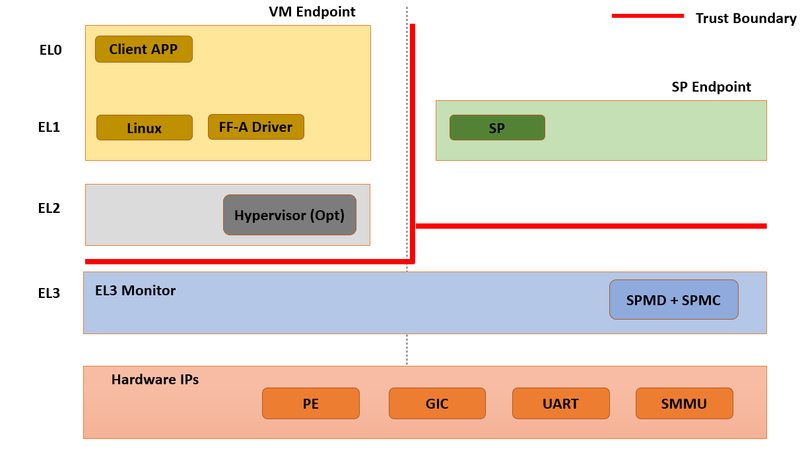

EL3 SPMC Threat Model
*********************

************************
Introduction
************************
This document provides a threat model for the TF-A `EL3 Secure Partition Manager`_
(EL3 SPM) implementation extension. The EL3 SPM implementation is based on the
`Arm Firmware Framework for Arm A-profile`_ specification.

************************
Target of Evaluation
************************
In this threat model, the target of evaluation is the EL3 firmware or the
``Secure Partition Manager Core`` component (SPMC).
The monitor and SPMD at EL3 are covered by the `Generic TF-A threat model`_.

The scope for this threat model is:

- The TF-A implementation for the EL3 SPMC
- The implementation complies with the FF-A v1.1 specification.
- Secure partition is statically provisioned at boot time.
- Focus on the run-time part of the life-cycle (no specific emphasis on boot
  time, factory firmware provisioning, firmware udpate etc.)
- Not covering advanced or invasive physical attacks such as decapsulation,
  FIB etc.

Data Flow Diagram
======================
Figure 1 shows a high-level data flow diagram for the SPM split into an SPMD
and SPMC component at EL3. The SPMD mostly acts as a relayer/pass-through between
the normal world and the secure world. It is assumed to expose small attack surface.

A description of each diagram element is given in Table 1. In the diagram, the
red broken lines indicate trust boundaries.

Components outside of the broken lines are considered untrusted.

.. uml:: ../resources/diagrams/plantuml/el3_spm_dfd.puml
  :caption: Figure 1: EL3 SPMC Data Flow Diagram

.. table:: Table 1: EL3 SPMC Data Flow Diagram Description

  +---------------------+--------------------------------------------------------+
  | Diagram Element     | Description                                            |
  +=====================+========================================================+
  | ``DF1``             | SP to SPMC communication. FF-A function invocation or  |
  |                     | implementation-defined Hypervisor call.                |
  +---------------------+--------------------------------------------------------+
  | ``DF2``             | SPMC to SPMD FF-A call.                                |
  +---------------------+--------------------------------------------------------+
  | ``DF3``             | SPMD to NS forwarding.                                 |
  +---------------------+--------------------------------------------------------+
  | ``DF5``             | HW control.                                            |
  +---------------------+--------------------------------------------------------+
  | ``DF6``             | Bootloader image loading.                              |
  +---------------------+--------------------------------------------------------+
  | ``DF7``             | External memory access.                                |
  +---------------------+--------------------------------------------------------+

*********************
Threat Analysis
*********************

This threat model follows a similar methodology to the `Generic TF-A threat model`_.
The following sections define:

- Trust boundaries
- Assets
- Theat agents
- Threat types

Trust boundaries
============================

- Normal world is untrusted.
- Secure world and normal world are separate trust boundaries.
- EL3 monitor, SPMD and SPMC are trusted.
- Bootloaders (in particular BL1/BL2 if using TF-A) and run-time BL31 are
  implicitely trusted by the usage of secure boot.
- EL3 monitor, SPMD, SPMC do not trust SPs.

    Figure 2: Trust boundaries

Assets
============================

The following assets are identified:

- SPMC state.
- SP state.
- Information exchange between endpoints (partition messages).
- SPMC secrets (e.g. pointer authentication key when enabled)
- SP secrets (e.g. application keys).
- Scheduling cycles.
- Shared memory.

Threat Agents
============================

The following threat agents are identified:

- NS-Endpoint identifies a non-secure endpoint: normal world client at NS-EL2
  (Hypervisor) or NS-EL1 (VM or OS kernel).
- S-Endpoint identifies a secure endpoint typically a secure partition.
- Hardware attacks (non-invasive) requiring a physical access to the device,
  such as bus probing or DRAM stress.

Threat types
============================

The following threat categories as exposed in the `Generic TF-A threat model`_
are re-used:

- Spoofing
- Tampering
- Repudiation
- Information disclosure
- Denial of service
- Elevation of privileges

Similarly this threat model re-uses the same threat risk ratings. The risk
analysis is evaluated based on the environment being ``Server`` or ``Mobile``.

Threat Assessment
============================

The following threats are identified by applying STRIDE analysis on each diagram
element of the data flow diagram.

+------------------------+----------------------------------------------------+
| ID                     | 01                                                 |
+========================+====================================================+
| ``Threat``             | **An endpoint impersonates the sender or receiver  |
|                        | FF-A ID in a direct request/response invocation.** |
+------------------------+----------------------------------------------------+
| ``Diagram Elements``   | DF1, DF2, DF3                                      |
+------------------------+----------------------------------------------------+
| ``Affected TF-A        | SPMD, SPMC                                         |
| Components``           |                                                    |
+------------------------+----------------------------------------------------+
| ``Assets``             | SP state                                           |
+------------------------+----------------------------------------------------+
| ``Threat Agent``       | NS-Endpoint, S-Endpoint                            |
+------------------------+----------------------------------------------------+
| ``Threat Type``        | Spoofing                                           |
+------------------------+------------------+-----------------+---------------+
| ``Application``        |   ``Server``     |   ``Mobile``    |               |
+------------------------+------------------++----------------+---------------+
| ``Impact``             | Critical(5)      | Critical(5)     |               |
+------------------------+------------------++----------------+---------------+
| ``Likelihood``         | Critical(5)      | Critical(5)     |               |
+------------------------+------------------++----------------+---------------+
| ``Total Risk Rating``  | Critical(25)     | Critical(25)    |               |
+------------------------+------------------+-----------------+---------------+
| ``Mitigations``        | The TF-A SPMC mitigates this threat.               |
|                        | The SPMC enforces checks in the direct message     |
|                        | request/response interfaces such an endpoint cannot|
|                        | spoof the origin and destination worlds (e.g. a NWd|
|                        | originated message directed to the SWd cannot use a|
|                        | SWd ID as the sender ID).                          |
+------------------------+----------------------------------------------------+

+------------------------+----------------------------------------------------+
| ID                     | 02                                                 |
+========================+====================================================+
| ``Threat``             | **Tampering with memory shared between an endpoint |
|                        | and the SPMC.**                                    |
|                        | A malicious endpoint may attempt tampering with its|
|                        | RX/TX buffer contents while the SPMC is processing |
|                        | it (TOCTOU).                                       |
+------------------------+----------------------------------------------------+
| ``Diagram Elements``   | DF1, DF3, DF7                                      |
+------------------------+----------------------------------------------------+
| ``Affected TF-A        | SPMC                                               |
| Components``           |                                                    |
+------------------------+----------------------------------------------------+
| ``Assets``             | Shared memory, Information exchange                |
+------------------------+----------------------------------------------------+
| ``Threat Agent``       | NS-Endpoint, S-Endpoint                            |
+------------------------+----------------------------------------------------+
| ``Threat Type``        | Tampering                                          |
+------------------------+------------------+-----------------+---------------+
| ``Application``        |   ``Server``     |   ``Mobile``    |               |
+------------------------+------------------+-----------------+---------------+
| ``Impact``             | High (4)         | High (4)        |               |
+------------------------+------------------+-----------------+---------------+
| ``Likelihood``         | High (4)         | High (4)        |               |
+------------------------+------------------+-----------------+---------------+
| ``Total Risk Rating``  | High (16)        | High (16)       |               |
+------------------------+------------------+-----------------+---------------+
| ``Mitigations``        | In context of FF-A v1.0 this is the case of sharing|
|                        | the RX/TX buffer pair and usage in the             |
|                        | PARTITION_INFO_GET or mem sharing primitives.      |
|                        | The SPMC must copy the contents of the TX buffer   |
|                        | to an internal temporary buffer before processing  |
|                        | its contents. The SPMC must implement hardened     |
|                        | input validation on data transmitted through the TX|
|                        | buffer by an untrusted endpoint.                   |
|                        | The TF-A SPMC mitigates this threat by enforcing   |
|                        | checks on data transmitted through RX/TX buffers.  |
+------------------------+----------------------------------------------------+

+------------------------+----------------------------------------------------+
| ID                     | 03                                                 |
+========================+====================================================+
| ``Threat``             | **An endpoint may tamper with its own state or the |
|                        | state of another endpoint.**                       |
|                        | A malicious endpoint may attempt violating:        |
|                        | - its own or another SP state by using an unusual  |
|                        | combination (or out-of-order) FF-A function        |
|                        | invocations.                                       |
|                        | This can also be an endpoint emitting              |
|                        | FF-A function invocations to another endpoint while|
|                        | the latter in not in a state to receive it (e.g. a |
|                        | SP sends a direct request to the normal world early|
|                        | while the normal world is not booted yet).         |
|                        | - the SPMC state itself by employing unexpected    |
|                        | transitions in FF-A memory sharing, direct requests|
|                        | and responses, or handling of interrupts.          |
|                        | This can be led by random stimuli injection or     |
|                        | fuzzing.                                           |
+------------------------+----------------------------------------------------+
| ``Diagram Elements``   | DF1, DF2, DF3                                      |
+------------------------+----------------------------------------------------+
| ``Affected TF-A        | SPMD, SPMC                                         |
| Components``           |                                                    |
+------------------------+----------------------------------------------------+
| ``Assets``             | SP state, SPMC state                               |
+------------------------+----------------------------------------------------+
| ``Threat Agent``       | NS-Endpoint, S-Endpoint                            |
+------------------------+----------------------------------------------------+
| ``Threat Type``        | Tampering                                          |
+------------------------+------------------+-----------------+---------------+
| ``Application``        |   ``Server``     |   ``Mobile``    |               |
+------------------------+------------------+-----------------+---------------+
| ``Impact``             | High (4)         | High (4)        |               |
+------------------------+------------------+-----------------+---------------+
| ``Likelihood``         | Medium (3)       | Medium (3)      |               |
+------------------------+------------------+-----------------+---------------+
| ``Total Risk Rating``  | High (12)        | High (12)       |               |
+------------------------+------------------+-----------------+---------------+
| ``Mitigations``        | The SPMC may be vulnerable to invalid state        |
|                        | transitions for itself or while handling an SP     |
|                        | state. The FF-A v1.1 specification provides a      |
|                        | guidance on those state transitions (run-time      |
|                        | model). The TF-A SPMC will be hardened in future   |
|                        | releases to follow this guidance.                  |
|                        | Additionally The TF-A SPMC mitigates the threat by |
|                        | runs of the Arm `FF-A ACS`_ compliance test suite. |
+------------------------+----------------------------------------------------+

+------------------------+----------------------------------------------------+
| ID                     | 04                                                 |
+========================+====================================================+
| ``Threat``             | **Replay fragments of past communication between   |
|                        | endpoints.**                                       |
|                        | A malicious endpoint may replay a message exchange |
|                        | that occured between two legitimate endpoint as    |
|                        | a matter of triggering a malfunction or extracting |
|                        | secrets from the receiving endpoint. In particular |
|                        | the memory sharing operation with fragmented       |
|                        | messages between an endpoint and the SPMC may be   |
|                        | replayed by a malicious agent as a matter of       |
|                        | getting access or gaining permissions to a memory  |
|                        | region which does not belong to this agent.        |
+------------------------+----------------------------------------------------+
| ``Diagram Elements``   | DF2, DF3                                           |
+------------------------+----------------------------------------------------+
| ``Affected TF-A        | SPMC                                               |
| Components``           |                                                    |
+------------------------+----------------------------------------------------+
| ``Assets``             | Information exchange                               |
+------------------------+----------------------------------------------------+
| ``Threat Agent``       | NS-Endpoint, S-Endpoint                            |
+------------------------+----------------------------------------------------+
| ``Threat Type``        | Repdudiation                                       |
+------------------------+------------------+---------------+-----------------+
| ``Application``        |   ``Server``     |  ``Mobile``   |                 |
+------------------------+------------------+---------------+-----------------+
| ``Impact``             | Medium (3)       | Medium (3)    |                 |
+------------------------+------------------+---------------+-----------------+
| ``Likelihood``         | High (4)         | High (4)	    |                 |
+------------------------+------------------+---------------+-----------------+
| ``Total Risk Rating``  | High (12)        | High (12)     |                 |
+------------------------+------------------+---------------+-----------------+
| ``Mitigations``        | The TF-A SPMC does not mitigate this threat.       |
+------------------------+----------------------------------------------------+

+------------------------+----------------------------------------------------+
| ID                     | 05                                                 |
+========================+====================================================+
| ``Threat``             | **A malicious endpoint may attempt to extract data |
|                        | or state information by the use of invalid or      |
|                        | incorrect input arguments.**                       |
|                        | Lack of input parameter validation or side effects |
|                        | of maliciously forged input parameters might affect|
|                        | the SPMC.                                          |
+------------------------+----------------------------------------------------+
| ``Diagram Elements``   | DF1, DF2, DF3                                      |
+------------------------+----------------------------------------------------+
| ``Affected TF-A        | SPMD, SPMC                                         |
| Components``           |                                                    |
+------------------------+----------------------------------------------------+
| ``Assets``             | SP secrets, SPMC secrets, SP state, SPMC state     |
+------------------------+----------------------------------------------------+
| ``Threat Agent``       | NS-Endpoint, S-Endpoint                            |
+------------------------+----------------------------------------------------+
| ``Threat Type``        | Information discolure                              |
+------------------------+------------------+---------------+-----------------+
| ``Application``        |   ``Server``     |  ``Mobile``   |                 |
+------------------------+------------------+---------------+-----------------+
| ``Impact``             | High (4)         | High (4)      |                 |
+------------------------+------------------+---------------+-----------------+
| ``Likelihood``         | Medium (3)       | Medium (3)    |                 |
+------------------------+------------------+---------------+-----------------+
| ``Total Risk Rating``  | High (12)        | High (12)     |                 |
+------------------------+------------------+---------------+-----------------+
| ``Mitigations``        | Secure Partitions must follow security standards   |
|                        | and best practises as a way to mitigate the risk   |
|                        | of common vulnerabilities to be exploited.         |
|                        | The use of software (canaries) or hardware         |
|                        | hardening techniques (XN, WXN, BTI, pointer        |
|                        | authentication, MTE) helps detecting and stopping  |
|                        | an exploitation early.                             |
|                        | The TF-A SPMC mitigates this threat by implementing|
|                        | stack protector, pointer authentication, BTI, XN,  |
|                        | WXN, security hardening techniques.                |
+------------------------+----------------------------------------------------+

+------------------------+----------------------------------------------------+
| ID                     | 06                                                 |
+========================+====================================================+
| ``Threat``             | **A malicious endpoint may forge a direct message  |
|                        | request such that it reveals the internal state of |
|                        | another endpoint through the direct message        |
|                        | response.**                                        |
|                        | The secure partition or SPMC replies to a partition|
|                        | message by a direct message response with          |
|                        | information which may reveal its internal state    |
|                        | (.e.g. partition message response outside of       |
|                        | allowed bounds).                                   |
+------------------------+----------------------------------------------------+
| ``Diagram Elements``   | DF1, DF2, DF3                                      |
+------------------------+----------------------------------------------------+
| ``Affected TF-A        | SPMC                                               |
| Components``           |                                                    |
+------------------------+----------------------------------------------------+
| ``Assets``             | SPMC or SP state                                   |
+------------------------+----------------------------------------------------+
| ``Threat Agent``       | NS-Endpoint, S-Endpoint                            |
+------------------------+----------------------------------------------------+
| ``Threat Type``        | Information discolure                              |
+------------------------+------------------+---------------+-----------------+
| ``Application``        |   ``Server``     |  ``Mobile``   |                 |
+------------------------+------------------+---------------+-----------------+
| ``Impact``             | Medium (3)       | Medium (3)    |                 |
+------------------------+------------------+---------------+-----------------+
| ``Likelihood``         | Low (2)          | Low (2)	    |                 |
+------------------------+------------------+---------------+-----------------+
| ``Total Risk Rating``  | Medium (6)       | Medium (6)    |                 |
+------------------------+------------------+---------------+-----------------+
| ``Mitigations``        | For the specific case of direct requests targeting |
|                        | the SPMC, the latter is hardened to prevent        |
|                        | its internal state or the state of an SP to be     |
|                        | revealed through a direct message response.        |
|                        | Further FF-A v1.1 guidance about run time models   |
|                        | and partition states will be implemented in future |
|                        | TF-A SPMC releases.                                |
+------------------------+----------------------------------------------------+

+------------------------+----------------------------------------------------+
| ID                     | 07                                                 |
+========================+====================================================+
| ``Threat``             | **Probing the FF-A communication between           |
|                        | endpoints.**                                       |
|                        | SPMC and SPs are typically loaded to external      |
|                        | memory (protected by a TrustZone memory            |
|                        | controller). A malicious agent may use non invasive|
|                        | methods to probe the external memory bus and       |
|                        | extract the traffic between an SP and the SPMC or  |
|                        | among SPs when shared buffers are held in external |
|                        | memory.                                            |
+------------------------+----------------------------------------------------+
| ``Diagram Elements``   | DF7                                                |
+------------------------+----------------------------------------------------+
| ``Affected TF-A        | SPMC                                               |
| Components``           |                                                    |
+------------------------+----------------------------------------------------+
| ``Assets``             | SP/SPMC state, SP/SPMC secrets                     |
+------------------------+----------------------------------------------------+
| ``Threat Agent``       | Hardware attack                                    |
+------------------------+----------------------------------------------------+
| ``Threat Type``        | Information disclosure                             |
+------------------------+------------------+-----------------+---------------+
| ``Application``        |   ``Server``     |   ``Mobile``    |               |
+------------------------+------------------+-----------------+---------------+
| ``Impact``             | Medium (3)       | Medium (3)      |               |
+------------------------+------------------+-----------------+---------------+
| ``Likelihood``         | Low (2)          | Medium (3)      |               |
+------------------------+------------------+-----------------+---------------+
| ``Total Risk Rating``  | Medium (6)       | Medium (9)      |               |
+------------------------+------------------+-----------------+---------------+
| ``Mitigations``        | It is expected the platform or chipset provides    |
|                        | guarantees in protecting the DRAM contents.        |
|                        | The TF-A SPMC does not mitigate this class of      |
|                        | attack and this is left to the integrator.         |
+------------------------+----------------------------------------------------+

+------------------------+----------------------------------------------------+
| ID                     | 08                                                 |
+========================+====================================================+
| ``Threat``             | **A malicious agent may attempt revealing the SPMC |
|                        | state or secrets by the use of software-based cache|
|                        | side-channel attack techniques.**                  |
+------------------------+----------------------------------------------------+
| ``Diagram Elements``   | DF7                                                |
+------------------------+----------------------------------------------------+
| ``Affected TF-A        | SPMC                                               |
| Components``           |                                                    |
+------------------------+----------------------------------------------------+
| ``Assets``             | SP or SPMC state                                   |
+------------------------+----------------------------------------------------+
| ``Threat Agent``       | NS-Endpoint, S-Endpoint                            |
+------------------------+----------------------------------------------------+
| ``Threat Type``        | Information disclosure                             |
+------------------------+------------------+-----------------+---------------+
| ``Application``        |   ``Server``     |   ``Mobile``    |               |
+------------------------+------------------+-----------------+---------------+
| ``Impact``             | Medium (3)       | Medium (3)      |               |
+------------------------+------------------+-----------------+---------------+
| ``Likelihood``         | Low (2)          | Low (2)         |               |
+------------------------+------------------+-----------------+---------------+
| ``Total Risk Rating``  | Medium (6)       | Medium (6)      |               |
+------------------------+------------------+-----------------+---------------+
| ``Mitigations``        | The SPMC may be hardened further with SW           |
|                        | mitigations (e.g. speculation barriers) for the    |
|                        | cases not covered in HW. Usage of hardened         |
|                        | compilers and appropriate options, code inspection |
|                        | are recommended ways to mitigate Spectre types of  |
|                        | attacks. For non-hardened cores, the usage of      |
|                        | techniques such a kernel page table isolation can  |
|                        | help mitigating Meltdown type of attacks.          |
+------------------------+----------------------------------------------------+

+------------------------+----------------------------------------------------+
| ID                     | 11                                                 |
+========================+====================================================+
| ``Threat``             | **A malicious endpoint may attempt flooding the    |
|                        | SPMC with requests targeting a service within an   |
|                        | endpoint such that it denies another endpoint to   |
|                        | access this service.**                             |
|                        | Similarly, the malicious endpoint may target a     |
|                        | a service within an endpoint such that the latter  |
|                        | is unable to request services from another         |
|                        | endpoint.                                          |
+------------------------+----------------------------------------------------+
| ``Diagram Elements``   | DF1, DF2, DF3                                      |
+------------------------+----------------------------------------------------+
| ``Affected TF-A        | SPMC                                               |
| Components``           |                                                    |
+------------------------+----------------------------------------------------+
| ``Assets``             | SPMC state                                         |
+------------------------+----------------------------------------------------+
| ``Threat Agent``       | NS-Endpoint, S-Endpoint                            |
+------------------------+----------------------------------------------------+
| ``Threat Type``        | Denial of service                                  |
+------------------------+------------------+-----------------+---------------+
| ``Application``        |   ``Server``     |   ``Mobile``    |               |
+------------------------+------------------+-----------------+---------------+
| ``Impact``             | Medium (3)       | Medium (3)      |               |
+------------------------+------------------+-----------------+---------------+
| ``Likelihood``         | Medium (3)       | Medium (3)      |               |
+------------------------+------------------+-----------------+---------------+
| ``Total Risk Rating``  | Medium (9)       | Medium (9)      |               |
+------------------------+------------------+-----------------+---------------+
| ``Mitigations``        | The TF-A SPMC does not mitigate this threat.       |
|                        | Bounding the time for operations to complete can   |
|                        | be achieved by the usage of a trusted watchdog.    |
|                        | Other quality of service monitoring can be achieved|
|                        | in the SPMC such as counting a number of operations|
|                        | in a limited timeframe.                            |
+------------------------+----------------------------------------------------+

+------------------------+----------------------------------------------------+
| ID                     | 11                                                 |
+========================+====================================================+
| ``Threat``             | **A malicious endpoint may attempt to donate       |
|                        | share lend relinquish or reclaim unauthorized      |
|                        | memory region.**                                   | 
+------------------------+----------------------------------------------------+
| ``Diagram Elements``   | DF1, DF2, DF3                                      |
+------------------------+----------------------------------------------------+
| ``Affected TF-A        | SPMC                                               |
| Components``           |                                                    |
+------------------------+----------------------------------------------------+
| ``Assets``             |  SP secrets, SPMC secrets, SP state, SPMC state    |
+------------------------+----------------------------------------------------+
| ``Threat Agent``       | NS-Endpoint, S-Endpoint                            |
+------------------------+----------------------------------------------------+
| ``Threat Type``        | Elevation of Privilege                             |
+------------------------+------------------+-----------------+---------------+
| ``Application``        |   ``Server``     |   ``Mobile``    |               |
+------------------------+------------------+-----------------+---------------+
| ``Impact``             | High (4)         | High   (4)      |               |
+------------------------+------------------+-----------------+---------------+
| ``Likelihood``         | High (4)         | High (4)        |               |
+------------------------+------------------+-----------------+---------------+
| ``Total Risk Rating``  | High (16)        | High (16)       |               |
+------------------------+------------------+-----------------+---------------+
| ``Mitigations``        | The TF-A SPMC does mitigate this threat by         |
|                        | tracking ownership and access state for memory     |
|                        | transactions appropriately, and validating the     |
|                        | same for all operations. SPMC follows FF-A v1.1    |
|                        | guidance for memory transaction lifecycle.         |
+------------------------+----------------------------------------------------+

---------------

*Copyright (c) 2022, Arm Limited. All rights reserved.*

.. _Arm Firmware Framework for Arm A-profile: https://developer.arm.com/docs/den0077/latest
.. _EL3 Secure Partition Manager: ../components/el3-spmc.html
.. _Generic TF-A threat model: ./threat_model.html#threat-analysis
.. _FF-A ACS: https://github.com/ARM-software/ff-a-acs/releases
