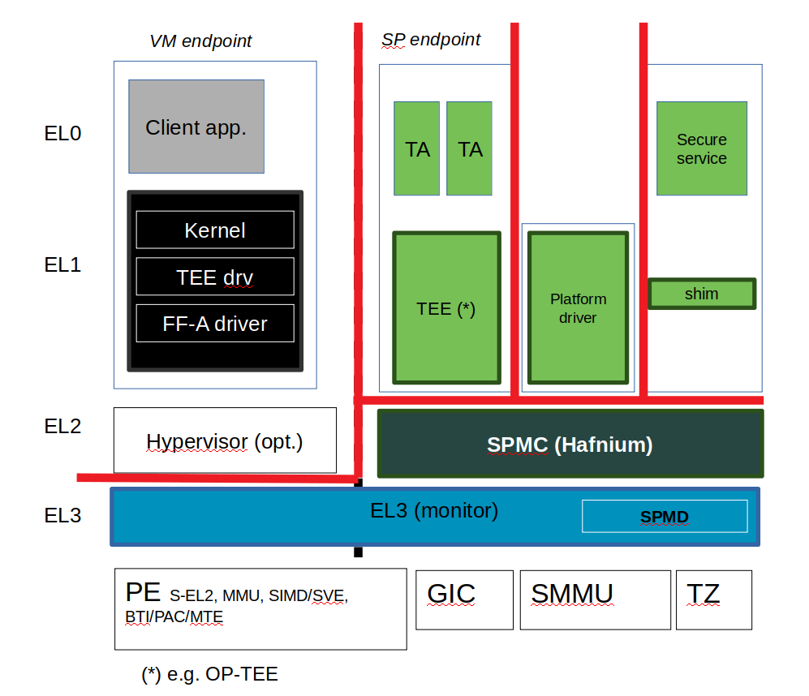

SPMC threat model
*****************

************************
Introduction
************************
This document provides a threat model for the TF-A `Secure Partition Manager`_
(SPM) implementation or more generally the S-EL2 reference firmware running on
systems implementing the FEAT_SEL2 (formerly Armv8.4 Secure EL2) architecture
extension. The SPM implementation is based on the `Arm Firmware Framework for
Armv8-A`_ specification.

In brief, the broad FF-A specification and S-EL2 firmware implementation
provide:

- Isolation of mutually mistrusting SW components, or endpoints in the FF-A
  terminology.
- Distinct sandboxes in the secure world called secure partitions. This permits
  isolation of services from multiple vendors.
- A standard protocol for communication and memory sharing between FF-A
  endpoints.
- Mutual isolation of the normal world and the secure world (e.g. a Trusted OS
  is prevented to map an arbitrary NS physical memory region such as the kernel
  or the Hypervisor).

************************
Target of Evaluation
************************
In this threat model, the target of evaluation is the S-EL2 firmware or the
``Secure Partition Manager Core`` component (SPMC).
The monitor and SPMD at EL3 are covered by the `Generic TF-A threat model`_.

The scope for this threat model is:

- The TF-A implementation for the SPMC based on the Hafnium hypervisor running
  in the secure world of TrustZone. The threat model is not related to the
  normal world Hypervisor or VMs. The S-EL1 SPMC
- The implementation complies to the FF-A v1.0 specification.
- Secure partitions are statically provisioned at boot time.
- Focus on the run-time part of the life-cycle (no specific emphasis on boot
  time, factory firmware provisioning, firmware udpate etc.)
- Not covering advanced or invasive physical attacks such as decapsulation,
  FIB etc.
- Assumes secure boot or in particular TF-A trusted boot (TBBR or dual CoT) is
  enabled. An attacker cannot boot arbitrary images that are not approved by the
  SiP or platform providers.

Data Flow Diagram
======================
Figure 1 shows a high-level data flow diagram for the SPM split into an SPMD
component at EL3 and an SPMC component at S-EL2. The SPMD mostly acts as a
relayer/pass-through between the normal world and the secure world. It is
assumed to expose small attack surface.

A description of each diagram element is given in Table 1. In the diagram, the
red broken lines indicate trust boundaries.

Components outside of the broken lines are considered untrusted.

.. uml:: ../resources/diagrams/plantuml/spm_dfd.puml
  :caption: Figure 1: SPMC Data Flow Diagram

.. table:: Table 1: SPMC Data Flow Diagram Description

  +---------------------+--------------------------------------------------------+
  | Diagram Element     | Description                                            |
  +=====================+========================================================+
  | ``DF1``             | SP to SPMC communication. FF-A function invocation or  |
  |                     | implementation-defined Hypervisor call.                |
  +---------------------+--------------------------------------------------------+
  | ``DF2``             | SPMC to SPMD FF-A call.                                |
  +---------------------+--------------------------------------------------------+
  | ``DF3``             | SPMD to NS forwarding.                                 |
  +---------------------+--------------------------------------------------------+
  | ``DF4``             | SP to SP FF-A function invocation.                     |
  +---------------------+--------------------------------------------------------+
  | ``DF5``             | HW control.                                            |
  +---------------------+--------------------------------------------------------+
  | ``DF6``             | Bootloader image loading.                              |
  +---------------------+--------------------------------------------------------+
  | ``DF7``             | External memory access.                                |
  +---------------------+--------------------------------------------------------+

*********************
Threat Analysis
*********************

This threat model follows a similar methodology to the `Generic TF-A threat model`_.
The following sections define:

- Trust boundaries
- Assets
- Theat agents
- Threat types

Trust boundaries
============================

- EL3 monitor, SPMD and SPMC are trusted.
- EL3 monitor, SPMD, SPMC do not trust SPs.
- Secure world and normal world are separate trust boundaries.
- Normal world is untrusted.

    Figure 2: Trust boundaries

Assets
============================

The following assets are identified:

- SPMC state.
- SP state.
- Information exchange between endpoints (partition messages).
- SPMC secrets (e.g. pointer authentication key when enabled)
- SP secrets (e.g. application keys).
- Scheduling cycles.
- Shared memory.

Threat Agents
============================

The following threat agents are identified:

- NS-Endpoint identifies a non-secure endpoint: normal world client at NS-EL2
  (Hypervisor) or NS-EL1 (VM or OS kernel).
- S-Endpoint identifies a secure endpoint typically a secure partition.
- Hardware attacks (non-invasive) requiring a physical access to the device,
  such as bus probing.

Threat types
============================

The following threat categories as exposed in the `Generic TF-A threat model`_
are re-used:

- Spoofing
- Tampering
- Repudiation
- Information disclosure
- Denial of service
- Elevation of privileges

Similarly this threat model re-uses the same threat risk ratings. The risk
analysis is evaluated based on the environment being ``Server`` or ``Mobile``.

Threat Assessment
============================

The following threats are identified by applying STRIDE analysis on each diagram
element of the data flow diagram.

+------------------------+----------------------------------------------------+
| ID                     | 01                                                 |
+========================+====================================================+
| ``Threat``             | **An endpoint impersonates the sender or receiver  |
|                        | FF-A ID in a direct request/response invocation.** |
|                        |                                                    |
|                        |                                                    |
|                        |                                                    |
|                        |                                                    |
|                        |                                                    |
|                        |                                                    |
|                        |                                                    |
+------------------------+----------------------------------------------------+
| ``Diagram Elements``   | DF1, DF2, DF3, DF4                                 |
+------------------------+----------------------------------------------------+
| ``Affected TF-A        | SPMD, SPMC                                         |
| Components``           |                                                    |
+------------------------+----------------------------------------------------+
| ``Assets``             | SP state                                           |
+------------------------+----------------------------------------------------+
| ``Threat Agent``       | NS-Endpoint, S-Endpoint                            |
+------------------------+----------------------------------------------------+
| ``Threat Type``        | Spoofing                                           |
+------------------------+------------------+-----------------+---------------+
| ``Application``        |   ``Server``     |   ``Mobile``    |               |
+------------------------+------------------++----------------+---------------+
| ``Impact``             | Critical(5)      | Critical(5)     |               |
+------------------------+------------------++----------------+---------------+
| ``Likelihood``         | Critical(5)      | Critical(5)     |               |
+------------------------+------------------++----------------+---------------+
| ``Total Risk Rating``  | Critical(25)     | Critical(25)    |               |
+------------------------+------------------+-----------------+---------------+
| ``Mitigations``        | The SPMC must enforce checks in the direct message |
|                        | request/response interfaces such an endpoint cannot|
|                        | spoof the origin and destination worlds (e.g. a NWd|
|                        | originated message directed to the SWd cannot use a|
|                        | SWd ID as the sender ID).                          |
|                        | Additionally a software component residing in the  |
|                        | SPMC can be added for the purpose of direct        |
|                        | request/response filtering.                        |
|                        | It can be configured with the list of known IDs    |
|                        | and about which interaction can occur between one  |
|                        | and another endpoint (e.g. which NWd endpoint ID   |
|                        | sends a direct request to which SWd endpoint ID).  |
|                        | This component checks the sender/receiver fields   |
|                        | for a legitimate communication between endpoints.  |
|                        | A similar component can exist in the OS kernel     |
|                        | driver, or Hypervisor although it remains untrusted|
|                        | by the SPMD/SPMC.                                  |
+------------------------+----------------------------------------------------+

+------------------------+----------------------------------------------------+
| ID                     | 02                                                 |
+========================+====================================================+
| ``Threat``             | **Tampering with memory shared between two         |
|                        | FF-A endpoints.**                                  |
|                        | A malicious endpoint may write to memory shared    |
|                        | with another endpoint while the latter is reading  |
|                        | or processing it (TOCTOU).                         |
|                        |                                                    |
|                        |                                                    |
|                        |                                                    |
|                        |                                                    |
+------------------------+----------------------------------------------------+
| ``Diagram Elements``   | DF1, DF3, DF4, DF7                                 |
+------------------------+----------------------------------------------------+
| ``Affected TF-A        | SPMC                                               |
| Components``           |                                                    |
+------------------------+----------------------------------------------------+
| ``Assets``             | Shared memory, Information exchange                |
+------------------------+----------------------------------------------------+
| ``Threat Agent``       | NS-Endpoint, S-Endpoint                            |
+------------------------+----------------------------------------------------+
| ``Threat Type``        | Tampering                                          |
+------------------------+------------------+-----------------+---------------+
| ``Application``        |   ``Server``     |   ``Mobile``    |               |
+------------------------+------------------+-----------------+---------------+
| ``Impact``             | High (4)         | High (4)        |               |
+------------------------+------------------+-----------------+---------------+
| ``Likelihood``         | High (4)         | High (4)        |               |
+------------------------+------------------+-----------------+---------------+
| ``Total Risk Rating``  | High (16)        | High (16)       |               |
+------------------------+------------------+-----------------+---------------+
| ``Mitigations``        | A secure partition must always copy the full buffer|
|                        | contents shared with it to an internal secure      |
|                        | buffer before processing data from this buffer.    |
|                        | This requirement comes with best practises in      |
|                        | writing secure software for TrustZone.             |
|                        | The buffer may have been shared through FF-A memory|
|                        | sharing primitives or be the RX/TX buffer pair.    |
+------------------------+----------------------------------------------------+

+------------------------+----------------------------------------------------+
| ID                     | 03                                                 |
+========================+====================================================+
| ``Threat``             | **An endpoint may tamper with its own state or the |
|                        | state of another endpoint.**                       |
|                        | A malicious endpoint may attempt violating:        |
|                        | - its own or another SP state by using an unusual  |
|                        | combination of FF-A function invocations.          |
|                        | This can also be an endpoint emitting              |
|                        | FF-A function invocations to another endpoint while|
|                        | the latter in not in a state to receive it (e.g. a |
|                        | SP sends a direct request to the normal world early|
|                        | while the normal world is not booted yet).         |
|                        | - the SPMC state itself by employing unexpected    |
|                        | transitions in FF-A memory sharing, direct requests|
|                        | and responses, or handling of interrupts.          |
|                        | This can be led by random stimuli injection or     |
|                        | fuzzing.                                           |
+------------------------+----------------------------------------------------+
| ``Diagram Elements``   | DF1, DF2, DF3, DF4                                 |
+------------------------+----------------------------------------------------+
| ``Affected TF-A        | SPMD, SPMC                                         |
| Components``           |                                                    |
+------------------------+----------------------------------------------------+
| ``Assets``             | SP state, SPMC state                               |
+------------------------+----------------------------------------------------+
| ``Threat Agent``       | NS-Endpoint, S-Endpoint                            |
+------------------------+----------------------------------------------------+
| ``Threat Type``        | Tampering                                          |
+------------------------+------------------+-----------------+---------------+
| ``Application``        |   ``Server``     |   ``Mobile``    |               |
+------------------------+------------------+-----------------+---------------+
| ``Impact``             | High (4)         | High (4)        |               |
+------------------------+------------------+-----------------+---------------+
| ``Likelihood``         | Medium (3)       | Medium (3)      |               |
+------------------------+------------------+-----------------+---------------+
| ``Total Risk Rating``  | High (12)        | High (12)       |               |
+------------------------+------------------+-----------------+---------------+
| ``Mitigations``        | The SPMC may be vulnerable to invalid state        |
|                        | transitions for itself or while handling an SP     |
|                        | state. The FF-A v1.1 specification provides        |
|                        | guidances on those state transitions so the        |
|                        | implementation shall improve by adopting the       |
|                        | standard. It is recommended the SPMC complies with |
|                        | the Arm provided `FF-A ACS`_ test suite.           |
+------------------------+----------------------------------------------------+

+------------------------+----------------------------------------------------+
| ID                     | 04                                                 |
+========================+====================================================+
| ``Threat``             | **Protection of the SPMC from a DMA capable device |
|                        | upstream to an SMMU.**                             |
|                        | A device may attempt to tamper with the internal   |
|                        | SPMC code/data sections.                           |
+------------------------+----------------------------------------------------+
| ``Diagram Elements``   | DF5                                                |
+------------------------+----------------------------------------------------+
| ``Affected TF-A        |                                                    |
| Components``           |                                                    |
+------------------------+----------------------------------------------------+
| ``Assets``             |                                                    |
+------------------------+----------------------------------------------------+
| ``Threat Agent``       |                                                    |
+------------------------+----------------------------------------------------+
| ``Threat Type``        | Tampering                                          |
+------------------------+------------------+---------------+-----------------+
| ``Application``        |   ``Server``     |  ``Mobile``   |                 |
+------------------------+------------------+---------------+-----------------+
| ``Impact``             |                  |		    |                 |
+------------------------+------------------+---------------+-----------------+
| ``Likelihood``         |                  |		    |                 |
+------------------------+------------------+---------------+-----------------+
| ``Total Risk Rating``  |                  |		    |                 |
+------------------------+------------------+---------------+-----------------+
| ``Mitigations``        |                                                    |
|                        |                                                    |
|                        |                                                    |
|                        |                                                    |
|                        |                                                    |
|                        |                                                    |
|                        |                                                    |
+------------------------+----------------------------------------------------+

+------------------------+----------------------------------------------------+
| ID                     | 05                                                 |
+========================+====================================================+
| ``Threat``             | **Replay fragments of past communication between   |
|                        | endpoints.**                                       |
|                        | A malicious endpoint may replay a message exchange |
|                        | that occured between two legitimate endpoint as    |
|                        | a matter of triggering a malfunction or extracting |
|                        | secrets from the receiving endpoint.               |
|                        |                                                    |
|                        |                                                    |
|                        |                                                    |
+------------------------+----------------------------------------------------+
| ``Diagram Elements``   |                                                    |
+------------------------+----------------------------------------------------+
| ``Affected TF-A        |                                                    |
| Components``           |                                                    |
+------------------------+----------------------------------------------------+
| ``Assets``             | Information exchange                               |
+------------------------+----------------------------------------------------+
| ``Threat Agent``       |                                                    |
+------------------------+----------------------------------------------------+
| ``Threat Type``        | Repdudiation                                       |
+------------------------+------------------+---------------+-----------------+
| ``Application``        |   ``Server``     |  ``Mobile``   |                 |
+------------------------+------------------+---------------+-----------------+
| ``Impact``             |                  |		    |                 |
+------------------------+------------------+---------------+-----------------+
| ``Likelihood``         |                  |		    |                 |
+------------------------+------------------+---------------+-----------------+
| ``Total Risk Rating``  |                  |		    |                 |
+------------------------+------------------+---------------+-----------------+
| ``Mitigations``        | SP partition protocol must be designed as robust to|
|                        | resists replay type of attacks.                    |
|                        |                                                    |
|                        |                                                    |
|                        |                                                    |
|                        |                                                    |
|                        |                                                    |
+------------------------+----------------------------------------------------+

+------------------------+----------------------------------------------------+
| ID                     | 06                                                 |
+========================+====================================================+
| ``Threat``             | **A malicious endpoint may attempt to extract data |
|                        | or state information by the use of invalid or      |
|                        | incorrect input arguments.**                       |
|                        | Lack of input parameter validation or side effects |
|                        | of maliciously forged input parameters might affect|
|                        | the SPMC.                                          |
+------------------------+----------------------------------------------------+
| ``Diagram Elements``   |                                                    |
+------------------------+----------------------------------------------------+
| ``Affected TF-A        | SPMD, SPMC                                         |
| Components``           |                                                    |
+------------------------+----------------------------------------------------+
| ``Assets``             | SP secrets, SPMC secrets, SP state, SPMC state     |
+------------------------+----------------------------------------------------+
| ``Threat Agent``       | NS-Endpoint, S-Endpoint                            |
+------------------------+----------------------------------------------------+
| ``Threat Type``        | Information discolure                              |
+------------------------+------------------+---------------+-----------------+
| ``Application``        |   ``Server``     |  ``Mobile``   |                 |
+------------------------+------------------+---------------+-----------------+
| ``Impact``             | High (4)         | High (4)      |                 |
+------------------------+------------------+---------------+-----------------+
| ``Likelihood``         | Medium (3)       | Medium (3)    |                 |
+------------------------+------------------+---------------+-----------------+
| ``Total Risk Rating``  | High (12)        | High (12)	    |                 |
+------------------------+------------------+---------------+-----------------+
| ``Mitigations``        | Secure Partitions must follow security standards   |
|                        | and best practises as a way to mitigate the risk   |
|                        | of common vulnerabilities to be exploited.         |
|                        | The use of software (canaries) or hardware         |
|                        | hardening techniques (XN, WXN, BTI, pointer        |
|                        | authentication) helps detecting and stopping an    |
|                        | exploitation early.                                |
|                        | The SPMC itself implements XN, WXN, BTI and pointer|
|                        | authentication hardening techniques.               |
+------------------------+----------------------------------------------------+

+------------------------+----------------------------------------------------+
| ID                     | 07                                                 |
+========================+====================================================+
| ``Threat``             | **A malicious endpoint may forge a direct message  |
|                        | request such that it reveals the internal state of |
|                        | another endpoint through the direct message        |
|                        | response.**                                        |
|                        | The secure partition or SPMC replies to a partition|
|                        | message by a direct message response with          |
|                        | information which may reveal its internal state    |
|                        | (.e.g. partition message response outside of       |
|                        | allowed bounds).                                   |
+------------------------+----------------------------------------------------+
| ``Diagram Elements``   |                                                    |
+------------------------+----------------------------------------------------+
| ``Affected TF-A        |                                                    |
| Components``           |                                                    |
+------------------------+----------------------------------------------------+
| ``Assets``             | SP state                                           |
+------------------------+----------------------------------------------------+
| ``Threat Agent``       |                                                    |
+------------------------+----------------------------------------------------+
| ``Threat Type``        | Information discolure                              |
+------------------------+------------------+---------------+-----------------+
| ``Application``        |   ``Server``     |  ``Mobile``   |                 |
+------------------------+------------------+---------------+-----------------+
| ``Impact``             | Medium (3)       | Medium (3)    |                 |
+------------------------+------------------+---------------+-----------------+
| ``Likelihood``         | Low (2)          | Low (2)	    |                 |
+------------------------+------------------+---------------+-----------------+
| ``Total Risk Rating``  | Medium (6)       | Medium (6)    |                 |
+------------------------+------------------+---------------+-----------------+
| ``Mitigations``        |                                                    |
|                        |                                                    |
|                        |                                                    |
|                        |                                                    |
|                        |                                                    |
|                        |                                                    |
|                        |                                                    |
+------------------------+----------------------------------------------------+

+------------------------+----------------------------------------------------+
| ID                     | 08                                                 |
+========================+====================================================+
| ``Threat``             | **Probing the FF-A communication between           |
|                        | endpoints.**                                       |
|                        | SPMC and SPs are typically loaded to external      |
|                        | memory (protected by a TrustZone memory controller)|
|                        | A malicious agent may use non invasive methods     |
|                        | to probe the external memory bus and extract the   |
|                        | the traffic between SPs or SPMC and SPs through the|
|                        | use of shared buffers.                             |
|                        |                                                    |
|                        |                                                    |
|                        |                                                    |
|                        |                                                    |
|                        |                                                    |
|                        |                                                    |
+------------------------+----------------------------------------------------+
| ``Diagram Elements``   | DF7                                                |
+------------------------+----------------------------------------------------+
| ``Affected TF-A        | SPMC                                               |
| Components``           |                                                    |
+------------------------+----------------------------------------------------+
| ``Assets``             | SP/SPMC state, SP/SPMC secrets                     |
+------------------------+----------------------------------------------------+
| ``Threat Agent``       | Hardware attack                                    |
+------------------------+----------------------------------------------------+
| ``Threat Type``        | Information disclosure                             |
+------------------------+------------------+-----------------+---------------+
| ``Application``        |   ``Server``     |   ``Mobile``    |               |
+------------------------+------------------+-----------------+---------------+
| ``Impact``             | Medium (3)       | Medium (3)      |               |
+------------------------+------------------+-----------------+---------------+
| ``Likelihood``         | Low (2)          | Medium (3)      |               |
+------------------------+------------------+-----------------+---------------+
| ``Total Risk Rating``  | Medium (6)       | Medium (9)      |               |
+------------------------+------------------+-----------------+---------------+
| ``Mitigations``        |                                                    |
|                        |                                                    |
|                        |                                                    |
|                        |                                                    |
|                        |                                                    |
|                        |                                                    |
|                        |                                                    |
+------------------------+----------------------------------------------------+

--------------

*Copyright (c) 2021, Arm Limited. All rights reserved.*

.. _Arm Firmware Framework for Armv8-A: https://developer.arm.com/docs/den0077/latest
.. _Secure Partition Manager: ../components/secure-partition-manager.html
.. _Generic TF-A threat model: ./threat_model.html#threat-analysis
.. _FF-A ACS: https://github.com/ARM-software/ff-a-acs/releases
